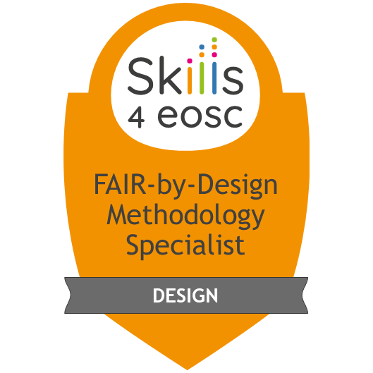
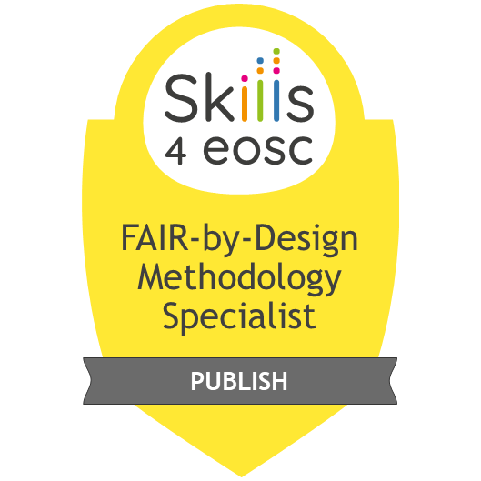

# FAIR-by-Design Training Facilitator Guide

The purpose of this document is to include all necessary information regarding the preparation and planning of the FAIR-by-Design Training of Trainers.
The training is organized as an online multi-day webinar using a Big Blue Button (BBB) room integrated into a Moodle based learning platform for course materials and interaction with trainees. 
The document is based on the recommendations by the TRIPLE project for Open Science training events organisation available [here](https://zenodo.org/record/6256198). The training organisation relies on three roles: organisers, moderators and trainers, where one person can have multiple roes
>NOTE: it is always a good practice to separate the roles of trainer and moderator, providing better interactivity of the training. If the training has more trainers, then they can interchangeably take the role of moderators when not speaking. 

## Training materials, resources and equipment
### Learning materials
The learning materials for the trainees should all be available on the learning platform before the beginning of the event, divided per learning sections (topics). 
At the top of the course before the learning sections add:
- link to BBB room
- open forum
- feedback form
- training syllabus

Each learning section should have:
- Slides in PDF
- Learning Notes (HTML of learning unit contents)
- Activity links or documents (if any)
- Further reading links
- Self-assessment quiz

The trainers materials latest version is taken from the GitHub repo.

### Resources
- Menti prepared according to the activities
    - if Menti is not available, use internal BBB quiz by copy-pasting the questions
- BBB room added to the course on the learning platform
- MD editor of choice (VS code)

## Before the training
### Organisers
- [ ] Send out save-the-date email
- [ ] Setup course on learning platform, enable self-enrollment for trainees, give all trainers appropriate rights
- [ ] Send out call for training including the syllabus and link to the course
- [ ] Prepare for activities (write questions in Menti and test) 
- [ ] Schedule testing in the BBB room for trainers (3-4 days before training)
- [ ] Schedule testing access to BBB room and learning materials for trainees (usually 30 mins before start of training)
- [ ] Contact speakers and moderators
- [ ] Assign moderator that will follow the chat and help with technical issues, Menti, etc.

### Moderators 
- [ ] Have access to training platform
- [ ] Have access to Menti to enter the questions
- [ ] Participate at the testing for trainers
- [ ] Participate at the testing for trainees

### Trainers/speakers
- [ ] Verify access to learning platform
- [ ] Publish the training materials on the learning platform
- [ ] Participate at the testing for trainers

## During the training
### Organisers
- [ ] Monitor the training delivery

### Moderators
- [ ] Monitor the training activities
- [ ] Monitor the Menti
- [ ] Monitor the chat and Q&A, convey questions to the trainers

### Trainers
- [ ] Use 00 to welcome participants, introduce people and define expectations and rules
- [ ] Ask people to jump in during the training at any time using chat or mic (moderator will follow and prompt the trainer if needed)
- [ ] The first ice breaking activity should also be used as a way to test if the interactive tool is working (BBB quiz and/or Menti)
- [ ] The main welcome activity is to be considered as input as to where to draw the attention when training and doing activities
- [ ] Create a discussion environment by having multiple trainers talking together about tips and tricks and encouraging others to join
- [ ] Use anonymous online tools for the practical activities to overcome shyness or fear of failure
- [ ] Encourage co-creation, ask others to recommend an action or tool or resource that may be used to accomplish a goal

## After the training
### Organisers
- [ ] Send out a reminder for feedback gathering and badge collecting
- [ ] Write down reflection comments for each training unit
- [ ] Analyze the feedback
- [ ] Initiate work on a new version of the training materials 

### Moderators
- [ ] Gather the feedback and convey it to the organisers
- [ ] Gather recordings and other results and send it to the organisers

### Trainers
- [ ] Analyse feedback for their performance
- [ ] Improve the training

## Badges
| Image | Name | Criteria |
|---|---|
| {: style="height:250px;"} | FAIR Instructor | Complete the full course \FAIR-by-Design Learning Materials Methodology\" with minimum grade of 80" |
| {: style="height:250px;"} | FAIR-by-Design Instructor - Prepare | Complete ALL of: Webinar recording, Stage 01 - Prepare Materials including Assessments |
| {: style="height:250px;"} | FAIR-by-Design Instructor - Discover | Complete ALL of: Webinar recording, Stage 02 - Discover Materials including Assessments |
| {: style="height:250px;"} | FAIR-by-Design Instructor - Design | Complete ALL of: Webinar recording, Stage 03 - Design Materials including Assessments |
| {: style="height:250px;"} | FAIR-by-Design Instructor - Produce | Complete ALL of: Webinar recording, Stage 04 - Produce Materials including Assessments |
| {: style="height:250px;"} | FAIR-by-Design Instructor - Publish | Complete ALL of: Webinar recording, Stage 05 - Publish Materials including Assessments |
| {: style="height:250px;"} | FAIR-by-Design Instructor - Verify + CI | Complete ALL of: Webinar recording, Stage 06 - Verify & CI Materials including Assessments |

## Learning Units Activities

### 00-Welcome
1. [Ice Breaker](./00-Welcome/Activities/00-ice_breaker.md)
2. [Challenges](./00-Welcome/Activities/01-challenges.md)

### 01-FAIR Skills & Principles
1. [Assessing FAIRness of Learning Materials](01-FAIR%20skills%20&%20principles/Activities/Assessing%20FAIRness%20of%20Learning%20Materials.md)

### 02-Preparing FAIR Learning Objects
1. [01-Checking Licenses](01-Checking%20Licenses.md)
2. [02-Attribution](02-Attribution.md)
3. [03-Ideation](03-Ideation.md)

### 03-Existing Learning Materials
1. [Finding Learning Materials](Finding%20Learning%20Materials.md)

### 04-Conceptualisation
1. [Creating_concept_map](Creating_concept_map.md)
2. [Defining_a_syllabus](Defining_a_syllabus.md)

### 05-Hierarchical Structure
1. [CombiningLicenses](CombiningLicenses.md)

### 06-Learning Unit Development
1. [Defining_a_plan](Defining_a_plan.md)
2. [Defining_a_quiz](Defining_a_quiz.md)

### 07-Facilitation
1. [Organisation](Organisation.md)

### 08-Development tools
1. [01-First Steps with Git](01-First%20Steps%20with%20Git.md)
2. [02-Setting up a Markdown Editor](02-Setting%20up%20a%20Markdown%20Editor.md)
3. [03-Working with Git Books](03-Working%20with%20Git%20Books.md)

### 09-Content Development
1. [01-Creating a Lesson Plan](01-Creating%20a%20Lesson%20Plan.md)

### 10-Content Mix
1. [01-Existing Meterials Reuse](01-Existing%20Meterials%20Reuse.md)
2. [02-Observing Changes](02-Observing%20Changes.md)

### 11-Accessibility
1. [LERA](LERA.md)
2. [PowerPointAccessibility](PowerPointAccessibility.md)

### 12-Content Finalisation 
1. [metadata](metadata.md)

### 13-Internal QA
1. [QAcheck](QAcheck.md)

### 16-Publishing preparations
1. [Publishing Preparations in Practice](Publishing%20Preparations%20in%20Practice.md)

### 17-Zenodo Publishing
1. [Creating a Zenodo Draft Deposit](Creating%20a%20Zenodo%20Draft%20Deposit.md)

### 18-Publishing to learning platform
1. [Adding content to the course on the learning platform](Adding%20content%20to%20the%20course%20on%20the%20learning%20platform.md)

### 19-Final QA check
1. [FinalQAself-check](FinalQAself-check.md)

### 20-Continuous Improvement
1. [Postcard_from_a_friend](Postcard_from_a_friend.md)

