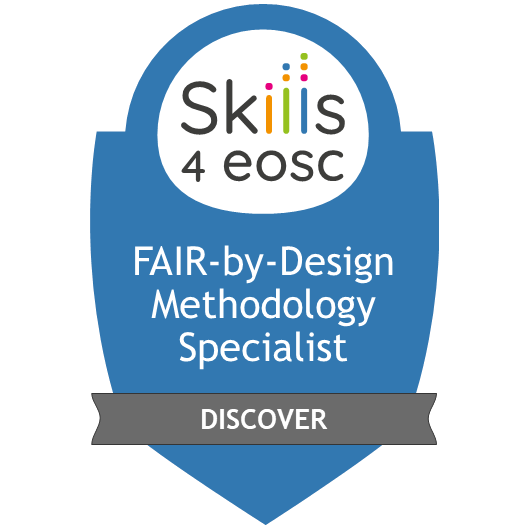
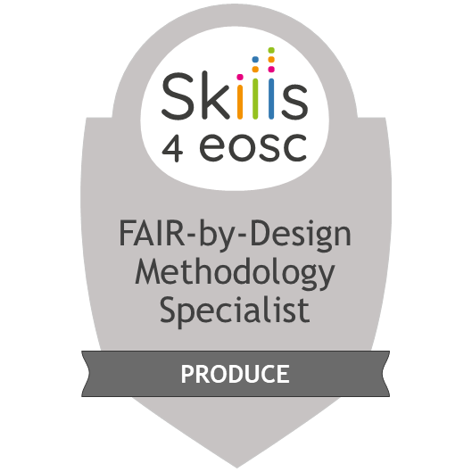

---
# RDA learning materials metadata minimal set
title: "FAIR-by-Design Methodology for Learning Materials Training of Trainers"
author: 
    - Sonja Filiposka
    - Dominique Green
    - Anastas Mishev
    - Vojdan Kjorveziroski
    - Andrea Corleto
    - Eleornora Napolitano 
    - Gabriella Paolini
    - Sara di Giorgio
    - Joanna Janik
    - Luca Schirru
    - Arnaud Gingold
    - Christine Chardosek
    - Irakleitos Souyioultzoglou
    - Carolin Leister
    - Emma Lazzeri
tags: 
    - FAIR
    - Learning Objects
    - Methodology
    - Practical Implementation

abstract: "The main goal of this ToT is to provide guidance and instructions on how to use the proposed FAIR-by-Design Methodology for development of FAIR learning materials in practice. The training will take you through all steps in the methodology and showcase their implementation using practical examples and developed templates."
primaryLanguage: "EN"
license: "https://creativecommons.org/licenses/by/4.0/"
versionDate: "2023-10-17"
urlToResource: "https://doi.org/10.5281/zenodo.10063110"
resourceURLType: "URL"
targetGroup: "All Skills4EOSC project members that will need to develop learning materials for any type of project-related training."
learningResourceType: "other"
learningOutcome: 
    - Define FAIR learning objects
    - Adapt and mix FAIR learning objects
    - Identify licenses and attribute correspondingly 
    - Structure comprehensive learning materials
    - Manage file formats and tools 
    - Define metadata using a schema
    - Create and publish FAIR-by-Design learning materials
    - Collaborate with other instructors
    - Assess FAIR-ness of existing learning objects
accessCost: "N"
expertiseLevel: "Beginner"
# template is a reserved keyword related to the git book itself and not part of the RDA metadata schema
template: signposting.html
---

# FAIR-by-Design Methodology for Learning Materials Training of Trainers
 
# Webinar

## Date/Time: 17-19 October 2023
...as the live training session has ended, we invite you to take a look at the recordings available on the BBB room link...

## Location

- [Skills4EOSC Learning Platform](https://learning.skills4eosc.eu/course/view.php?id=19)
- [BBB room](https://learning.skills4eosc.eu/mod/bigbluebuttonbn/view.php?id=25) 

## Training Description

The main goal of this ToT is to provide guidance and instructions on how to use the proposed FAIR-by-Design Methodology for development of FAIR learning materials in practice. The training will take you through all steps in the methodology and showcase their implementation using practical examples and developed templates.

## Target audience

All Skills4EOSC project members that will need to develop learning materials for any type of project-related training.

## Expertise Level / Skill Level: Beginner

## Primary Language: English

## Access Cost: No

## Prerequisites

No prior knowledge is required to follow the training, however see Resources and Materials to prepare beforehand

## Duration

The training will take place in the course of three days in the full day + full day + half day format. The total length of the training is ~18 hours.

## Learning Objectives

- Define FAIR learning objects
- Adapt and mix FAIR learning objects
- Identify licenses and attribute correspondingly 
- Structure comprehensive learning materials
- Manage file formats and tools 
- Define metadata using a schema
- Create and publish FAIR-by-Design learning materials
- Collaborate with other instructors
- Assess FAIR-ness of existing learning objects

## Keywords

FAIR, learning objects, methodology, practical implementation

## Agenda: Training Schedule - Training Structure

Note: start time is given in CEST

### Day 1: FAIR-by-Design Preparation, Discovery & Design

|     Start    |     Stage       |     Topic                                      |     Duration    |
|--------------|-----------------|------------------------------------------------|-----------------|
|      9:00    |                 |     Introduction                               |     30 mins     |
|      9:30    |     Prepare     |     FAIR skills & principles                   |     35 mins     |
|     10:05    |                 |     = coffee break =                           |     15 mins     |
|     10:20    |     Prepare     |     Defining FAIR learning objects             |     60 mins     |
|     11:20    |                 |     = coffee break =                           |     15 mins     |
|     11:35    |     Discover    |     Discovering existing learning materials    |     60 mins     |
|     12:35    |                 |     = Lunch break =                            |     60 mins     |
|     13:35    |     Design      |     Conceptualisation                          |     35 mins     |
|     14:10    |     Design      |     Hierarchical Structure                     |     40 mins     |
|     14:50    |                 |     = coffee break =                           |     15 mins     |
|     15:05    |     Design      |     Learning Unit Development                  |     45 mins     |
|     15:50    |     Design      |     Instruction Facilitation                   |     45 mins     |

### Day 2: Producing Learning Materials

|     Start    |     Stage      |     Topic                        |     Duration    |
|--------------|----------------|----------------------------------|-----------------|
|      9:00    |     Produce    |     Development Tools            |    120 mins     |
|     11:00    |                |     = coffee break =             |     15 mins     |
|     11:15    |     Produce    |     Content Development          |     75 mins     |
|     12:30    |                |     = Lunch break =              |     60 mins     |
|     13:30    |     Produce    |     Content Mix                  |     55 mins     |
|     14:25    |     Produce    |     Content Mix Slide Deck       |     30 mins     |
|     14:55    |     Produce    |     Accessibility                |     55 mins     |
|     15:50    |                |     = coffee break =             |     15 mins     |
|     16:05    |     Produce    |     Content Finalisation         |     25 mins     |
|     16:30    |     Produce    |     Internal Quality Assurance   |     20 mins     |
|     16:50    |     Produce    |     Team collaboration           |     15 mins     |
|     17:05    |     Produce    |     Alternative approach         |     20 mins     |

### Day 3: Publish & Verify FAIR-by-Design Learning Materials

|     Start    |     Stage      |     Topic                   |     Duration    |
|--------------|----------------|-----------------------------|-----------------|
|      9:00    |     Publish    |     Publishing Preparations |     35 mins     |
|      9:35    |     Publish    |     Publishing in Zenodo    |     55 mins     |
|     10:30    |                |     = coffee break =        |     15 mins     |
|     10:45    |     Publish    |     Publish on LMS          |     35 mins     |
|     11:20    |     Verify     |     QA & FAIR verification  |     40 mins     |
|     12:00    |                |     Continuous Improvement  |     30 mins     |

## Resources and Materials

All training resources will be available on the FAIR-by-Design methodology course on the learning platform. You will need to self-enrol in the course to gain access to the materials. Additional equipment and software needed to take full advantage of the training activities:

- Headset with microphone
- GitHub account: [GitHub SignUp](https://github.com/signup?ref_cta=Sign+up&ref_loc=header+logged+out&ref_page=%2F&source=header-home)
- Zenodo account: [Zenodo SignUp](https://zenodo.org/signup/)
- Installed Git client: [Git Editor](https://desktop.github.com/)
- Installed MD editor: [Obsidian](https://obsidian.md/)
    - or you can also use an online demo version such as [https://demo.hedgedoc.org/](https://demo.hedgedoc.org/) (for testing purposes only)

## Certification Information (Digital Open Badges and Microcredentials)

The trainees that will pass the completion criteria for each separate stage of the FAIR-by-Design methodology will be awarded with corresponding open digital badges. All trainees that will successfully complete all activities available on the course on the learning platform will be able to obtain the higher level “FAIR Instructor” open digital badge. 

| Badge | Name | Criteria |
|---|---|---|
| {: style="width:350px;"} | FAIR Instructor | Complete the full course FAIR-by-Design Learning Materials Methodology with minimum grade of 80% |
| {: style="width:350px;"} | FAIR-by-Design Instructor - Prepare | Complete ALL of: Webinar recording, Stage 01 - Prepare Materials including Assessments |
| {: style="width:350px;"} | FAIR-by-Design Instructor - Discover | Complete ALL of: Webinar recording, Stage 02 - Discover Materials including Assessments |
| {: style="width:350px;"} | FAIR-by-Design Instructor - Design | Complete ALL of: Webinar recording, Stage 03 - Design Materials including Assessments |
| {: style="width:350px;"} | FAIR-by-Design Instructor - Produce | Complete ALL of: Webinar recording, Stage 04 - Produce Materials including Assessments |
| {: style="width:350px;"} | FAIR-by-Design Instructor - Publish | Complete ALL of: Webinar recording, Stage 05 - Publish Materials including Assessments |
| {: style="width:350px;"} | FAIR-by-Design Instructor - Verify + CI | Complete ALL of: Webinar recording, Stage 06 - Verify & CI Materials including Assessments |

## Authors

Sonja Filiposka, Dominique Green, Anastas Mishev, Vojdan Kjorveziroski, Andrea Corleto, Eleornora Napolitano, Gabriella Paolini, Sara di Giorgio, Joanna Janik, Luca Schirru, Arnaud Gingold, Christine Chardosek, Irakleitos Souyioultzoglou, Carolin Leister, Emma Lazzeri

# Trainers 

Sonja Filiposka , Anastas Mishev , Vojdan Kjorveziroski 

## Contact information

For more information regarding the training please contact the T2.3 FAIR-by-Design Methodology Task Leader Sonja Filiposka using [sonja.filiposka@finki.ukim.mk](mailto:sonja.filiposka@finki.ukim.mk). 

## License
 This work is licensed under a <a rel="license" href="http://creativecommons.org/licenses/by/4.0/">Creative Commons Attribution 4.0 International License</a>.

## DOI
[https://doi.org/10.5281/zenodo.10063110](https://doi.org/10.5281/zenodo.10063110)

## Accessibility Mission
Skills4EOSC is dedicated to ensuring that all produced learning materials are accessible to as many visitors as possible regardless of their ability or technology. We have an active commitment to increasing our learning materials accessibility. The main standards that we aim to comply with are WCAG v.2.1 Level AA criteria and PDF/UA (ISO 14289).

### Acknowledgement

These learning materials have been developed by following the [FAIR-by-Design Methodology](https://doi.org/10.5281/zenodo.7875540). 

