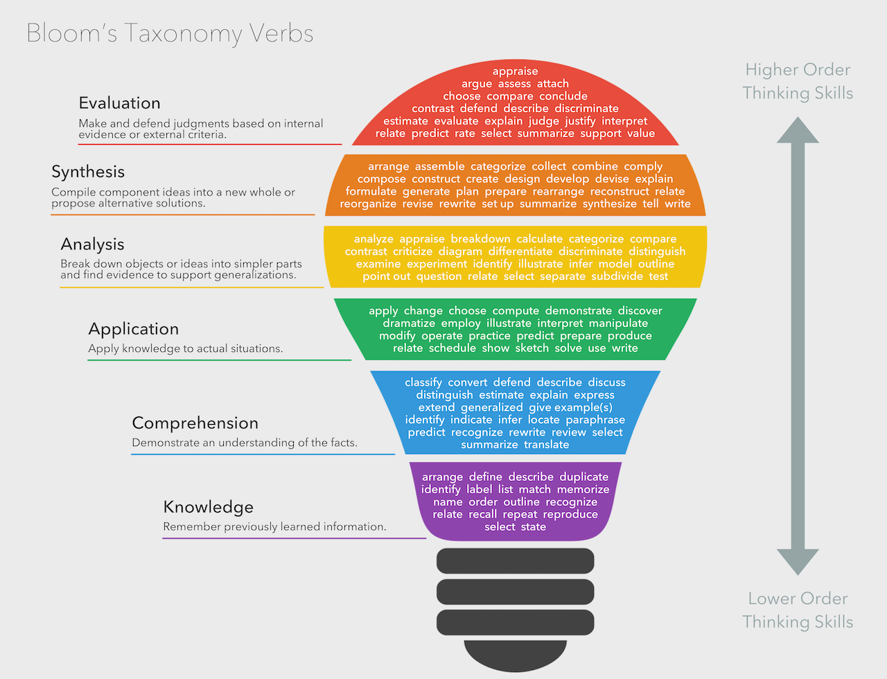

## Backward instructional design process

The backward design first focuses on the learning outcomes that one wants to achieve and then works backward to the topics that need to be covered in order to achieve the learning objectives. 

"[Backward design model](http://campdesign.online/documents/backward_design_model_april_2020.pdf)" from [Muhlenberg College](http://campdesign.online/backwarddesign.html) licensed under the [CC BY-NC 4.0](https://creativecommons.org/licenses/by-nc/4.0/). 

By following this process, the learner becomes the focal point of the training, making the developed learning materials learner-centric.

### Ideating a learning resource

According to best practices for the [instructional design process](https://www.skillcast.com/blog/instructional-design-best-practices) in the initial preparation phase (step 1) there should be a clear definition of the **overarching aspects and considerations** related to the learning materials that are going to be created. 

The aspects that need to be defined first are:

- **Purpose** of learning material
    - when and how the learning materials can be used and for what purposes
- **Target Audience**
    – the primary audience for the learning materials 
    - is there anything specific that needs to be taken into account, such as cultural context
- **Prerequisites**
    - what does the target audience need to know or understand before starting the learning process
    - it is suggested to use names and links to other learning materials if possible
- **Overall Scope of the learning materials**
    - is it going to be a single learning object, or an aggregation of some sort such as a course
- **Learning Objectives** 
    - what competences will be gained after successful completing of the learning process

If possible, the choice of a delivery platform should be postponed to the design step as to ensure that the choice is compatible with the types of learning objects identified for potential reuse.

### Defining learning objectives

Learning objectives should describe what new knowledge and skills will be obtained in a specific, measurable, attainable, relevant and time-bound (SMART) way. 

The learning objectives are used to organize specific topics or individual learning activities so that the learner can most effectively achieve the overall learning outcome.

To ensure standardization and wide understanding of the learning objective, it is best practice to define the learning objectives using a well-known taxonomy such as the [Bloom’s taxonomy](https://cmapspublic2.ihmc.us/rid=1Q2PTM7HL-26LTFBX-9YN8/Krathwohl%202002.pdf). 

The Bloom's Taxonomy is a classification of the different objectives and skills that educators set for their students (learning outcomes). The cognitive domain categorizes the human learning process into 6 hierarchical levels: Remember, Understand, Apply, Analyze, Evaluate, and Create. 

"[Bloom's Revised Taxonomy](https://www.flickr.com/photos/vandycft/29428436431)" by [Vanderbilt University Center for Teaching](https://cft.vanderbilt.edu) licensed under the terms of the [CC-BY-2.0](https://creativecommons.org/licenses/by/2.0/).

When defining learning objectives using the Bloom's taxonomy, correct verbs should be used for each objective based on the level the learners needs to achieve. For these purposes the example verbs provided in the image can be used.

[Bloom's taxonomy](https://en.wikipedia.org/wiki/Bloom%27s_taxonomy#/media/File:Bloom%E2%80%99s_Taxonomy_Verbs.png) by [Fractus Learning](https://www.fractuslearning.com/). (2023, July 10). In [Wikipedia](https://en.wikipedia.org/wiki/Bloom%27s_taxonomy) licensed under the terms of [CC BY-SA 4.0](https://creativecommons.org/licenses/by/4.0/).  

This approach will significantly improve the findability of the produced resources, as well as the potential reuse of individual learning objects in different aggregations.

The number of learning objectives depends on the aggregation level of the learning resource that is being developed. 

### Ideation exercise

You are creating an Open Science training course for policy makers. You just learned the essentials of the FAIR principles and the backward instructional design process and are now in the initial ideating stage.

Define the essential elements of your training:

- purpose
- target audience
- prerequisites
- scope
- learning objectives (min 3 using verbs from the Bloom's taxonomy)

Discuss any challenges you faced during this exercise. 
Which of these elements are going to be part of the metadata describing your newly created learning materials?

## Summary

Before starting with the design process, a FAIR instructor needs to get familiar with the main elements needed to implement the FAIR guiding principles: metadata, PIDs, repos, licensing and attribution.
Then the instructional design can begin following a backward approach: define the learning objectives you want to achieve so that they can guide you to properly structure the learning materials.

## Suggested Reading

- [Where to start: Backward Design by MIT Teaching and Learning Lab](https://tll.mit.edu/teaching-resources/course-design/backward-design/)
- [Terrell Heick, What Is Bloom’s Taxonomy? A Definition For Teachers, on Teach Thought, August 14, 2021 ](https://www.teachthought.com/learning/what-is-blooms-taxonomy/)