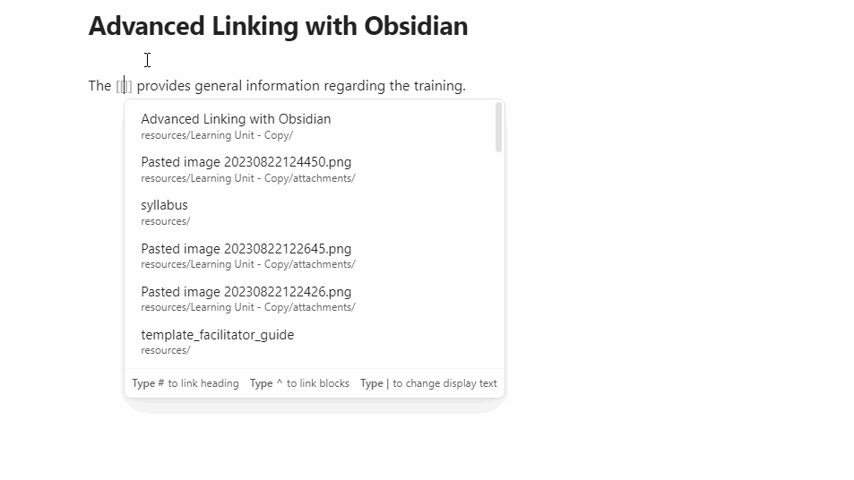
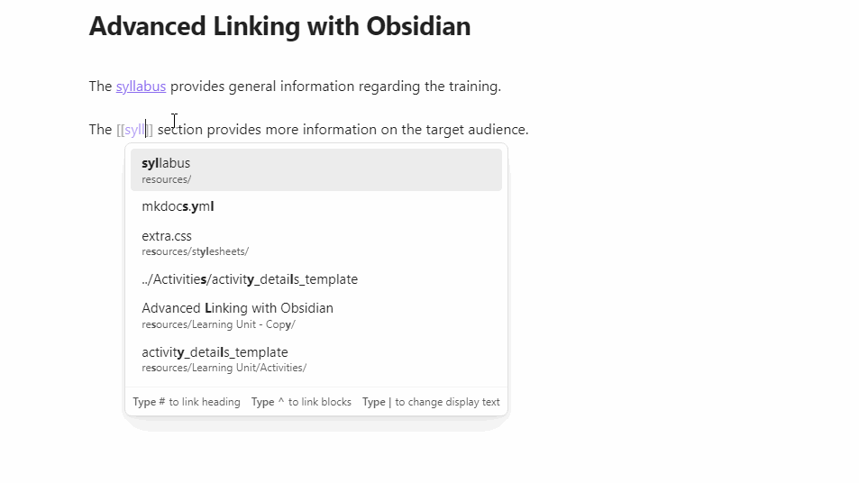

# Markdown Syntax

The purpose of this learning unit is to introduce the basic Markdown syntax necessary for producing FAIR-by-Design learning objects. We will be working with some common Markdown elements, such as: headings, tables, links, images, and lists. We will also be extending existing Markdown files so that they are compliant with the FAIR-by-Design methodology.

## Learning Objectives

- Recognize the most important Markdown syntax elements
- Develop new learning materials from scratch by applying the Markdown syntax on existing template documents
- Manipulate existing learning objects, making them compliant with the FAIR-by-Design methodology. 

## Target Audience

- Attendees of the FAIR-by-Design ToT live webinar

## Duration

75 mins

## Prerequisites

Completed [08 - Development Tools](../08-Development%20Tools/08-Introduction%20to%20Markdown%20and%20Git.md)

## Learning Tools

- Training BBB room
- Browser
- Menti access or BBB quiz interaction
- GitHub Desktop Software
- Obsidian Markdown Editor

## Introduction

Markdown, being a plain text file format, faces an interesting challenge when it comes to text formatting. To facilitate the visual design options which are taken for granted when using full-fledged word processors such as headings, letter formatting using bold, italic, unordered lists, ordered lists, etc..., Markdown must resort to a special, but simple, syntax. In the sections that follow we will explore ways in which we can accomplish the following tasks using Markdown:

- define headings at different levels
- create ordered lists
- create unordered lists
- format text to be shown as a link
- insert images
- use tables with arbitrary number of rows and columns
- format text
- write metadata

In addition to the concepts above, we will also tackle ways in which additional metadata information can be assigned to Markdown files through the use of special headers, which are not rendered when rendering to a final file format such as HTML or PDF.

The participants will have a chance to get hands-on experience with all of these concepts by taking part in the interactive exercises organized throughout this section. They focus on working with the existing Markdown templates prepared by the FAIR-by-Design methodology team, as well as on reusing existing content that might not necessarily confirm to the FAIR-by-Design methodology at first and adapting it.

## Overview of the Markdown Syntax

In this section we will go over the basic Markdown syntax that will be needed to edit the existing Markdown templates. For each action, we will attempt to describe two approaches: manual, without utilizing any Obsidian extensions; assisted, where the WYSIWYG editing toolbar is used, together with additional extensions with the end-goal of simplifying the Markdown typing experience. When working on your own learning materials, you are welcome to use whatever approach works best for you. It is also very much possible to take a hybrid approach, writing raw Markdown by hand for some simple aspects, while resorting to extensions for other, more complex tasks (e.g., table formatting).

Note that Markdown only defines the syntax for the document formatting, the final visual appearance of the output such as the font size and color is in most cases determined by the design choices of the tool used for converting `.md` files. The very page that you are currently reading has also been written as a Markdown document which has then been converted to HTML using the MkDocs framework. In this the chosen MkDocs theme has defined that headings will have a blue color, while links will be pink. Of course, if desired, these visual options can also be further customized by modifying the MkDocs configuration.

### Defining Headings

Headings can be defined by prefixing the line with the `#` symbol. The heading level is dependant on the number of `#` present, so a single `#` character represents heading at level 1, `##` represent a heading 2, `###` heading 3... Below is an excerpt of a document which uses different heading levels.

```md
# This is heading 1

Lorem ipsum...

## This is heading 2

Lorem ipsum...

### This is heading 3

Lorem ipsum...
```

The toolbar in Obsidian has dedicated selection buttons for the most common headings:


### Ordered Lists

Ordered lists can be created in a very intuitive way, by simply prefixing the line with the appropriate number:

```md
1. Item 1
2. Item 2
3. Item 3
```

It is recommended to have an empty line both before and after the ordered list, helping legibility:

```md
Lorem ipsum dolor est.

1. Item 1
2. Item 2
3. Item 3

Lorem ipsum dolor est.
```

The image below shows how ordered lists can be created using the toolbar in Obsidian. Note that once the first element is defined, future new lines will automatically be prefixed with the next number in the sequence. To interrupt the automatic numbering, and thus break out of the ordered list, simply enter two new lines one after the other.


#### Nesting Ordered Lists

Ordered lists can of course be nested. Simply press the `Tab` key on a blank line and reset the numbering, like so:

```md
1. Item 1
    1. Item 1.1
	2. Item 1.2
```

The same can be accomplished using the toolbar in Obsidian, by clicking on the (un)indent button or pressing `Tab` on the keyboard.


### Unordered Lists

Unordered lists can be created in a similar way as ordered list, with the only difference being the prefix. Instead of a number, the line prefix in this case can either be a `-` or `*`.

```md
- first thing
- second thing
- third thing
```

As expected, the toolbar in Obsidian also has a dedicated button for creating unordered lists:


#### Nesting Unordered Lists

Unordered lists can be nested in the same way as ordered lists. In this case, after clicking tab on a new line simply enter the preferred unordered list character (`-` or `*`). Additionally, it also possible to have a top-level ordered list and the nested list to be unordered or vice versa.

```md
1. Element 1
2. Element 2
	- subelement 1
	- subelement 2
3. Element 3
	1. sublement 1
	2. subelement 2
```

When using the toolbar in Obsidian, the same (un)indent button can be used both for formatting the nesting of numbered and unnumbered lists.

### Links

The syntax for defining links is:

```md
[FAIR-by-Design Methodology](https://zenodo.org/record/7875541)
```

The part in the `[]` brackets will be the link text, while the `()` define the target location. The above link would be rendered as [FAIR-by-Design Methodology](https://zenodo.org/record/7875541).

When using Obsidian with the toolbar, simply write the link text, select it, and click the anchor button. This will put square brackets around the existing text, and provide empty brackets for the link location:


It is also possible to add relative links to an arbitrary heading on the existing page or a different page. The syntax for doing so is:

```md
[See here for more details about unordered lists](09-Markdown Syntax.md#unordered-lists)
```

The above would be rendered as [See here for more details about unordered lists](09-Markdown Syntax.md#unordered-lists). Diving into more details, the syntax is: `markdown-file.md#heading`. The first part is the Markdown file name, as stored on your computer, then a single `#` sign (no matter the heading level) and finally the full name of the heading in all lowercase letters where any spaces are replaced by a `-`.

#### Advanced Linking with Obsidian

***Trainees are recommended to go over this section once they have familiarized themselves with the rest of the Markdown concepts. During the initial reading this section can be skipped.***

Linking between learning units or even to specific sections of a given learning unit is a common task when designing learning materials. However, when it comes to complex trainings involving many Markdown files, manually writing the location of the reference document can be an error prone operation. Obsidian has built-in functionality to make the process of linking between Markdown documents easier. 

For Obsidian to use the appropriate Markdown syntax, ensure that the option `Use [[Wikilinks]]` is disabled in `Obsidian Settings -> Files & Links`, as discussed in [08-Development Tools](../08-Development%20Tools/08-Setting%20up%20a%20Markdown%20Editor.md).

Whenever a link needs to be inserted, simply press `[[` on the keyboard and an Obsidian autocompletion window will open. Search for the title of the desired page to which you would like to link and simply press `Enter`. By default Obsdiian will enter the page name as the name of the link, but this can be changed by altering the text in the `[]` brackets.



Obsidian can also help with the initial construction of a link to a subsection within a document, but manual changes are needed in this case. To link to an arbitrary heading within a document:

- open the autocompletion window using `[[`
- find the page that you would like to link to
- instead of pressing `Enter`, press the `#` key
- Obsidian will open a heading discovery window which you can use to select the appropriate heading
- Pressing `Enter` will construct the link

One final change needs to be made to the link, since it will not be in the MkDocs expected format. As discussed previously, the full name of the heading which is specified after the `#` sign should be typed in all lowercase letters where any spaces are replaced by a `-`. The link can be manually adjusted to conform to this spec by converting all uppercase letters to lowercase and replacing all occurrences of `%20` with `-` after the `#`, as shown in the image below.



### Images

The syntax for inserting images is very similar to the one for inserting links. The only difference is the `!` prefix which is required:

```md

```

The above would be rendered as:


*(Image by Gundula Vogel from Pixabay)*

In this case the text between the `[]` brackets will be added as an `alt` text for the image, visible when the image cannot be shown or when the user is using accessibility tools such as a screen reader.

In case a locally available image needs to be inserted, Obsidian supports simple copy-pasting of the desired file. It will automatically be uploaded to the `attachments` folder and linked within the currently open Markdown document. This behavior is shown in the image below.


When pushed to the Git repository, the automatic MkDocs workflow will take care of transforming the relative file path of the image to the correct URL.

### Tables

Unlike the previous elements, creating tables by hand in Markdown can be a somewhat complicated process. The basic syntax for a three-column, three-row table is given below:


```md
| ID | Project     | Year |
|----|-------------|------|
| 1  | Skills4EOSC | 2022 |
| 2  | NI4OS       | 2019 |
```

While visually simple, creating more complex tables manually can become an elaborate process. The header row is separated from the rest of the rows by the `|----|-------------|------|` line above. The number of dashes between the `|` is not important, and it can be varied to accomplish a better visual representation in the source Markdown file. The above table, when rendered, is shown as:

| ID | Project     | Year |
|----|-------------|------|
| 1  | Skills4EOSC | 2022 |
| 2  | NI4OS       | 2019 |

Obsidian, using the third party plugin that we already installed in one of the previous exercises provides a simpler approach to creating tables, using a graphical interface. After the `Markdown Table Editor` plugin is installed, it can be used by clicking on its dedicated button on the left-hand side.


Depending on the current context, one of two options is possible:

- if an existing table is selected, the plugin will launch in editing mode
- if no table is present, a new one will be created, and the edit mode will be launched


If additional rows or columns need to be added, that can be accomplished by clicking on the three dots next to the currently selected cell:


Once satisfied with the result, the Markdown can automatically be generated by clicking the `Update Table` button.


In case other editors that have no support for table plugins are used, free services such as [Tables Generator](https://www.tablesgenerator.com/markdown_tables) can be of help. In this case, a visual editor for the table is offered, similar to the Obsidian plugin, and the corresponding Markdown can be copied and then pasted into the `.md` file.

### Text Formatting

Markdown also supports common text formatting operations, such as bold, italic, and strikethrough. The syntax is presented below:

```
**This is a bold text.**

*This is an italic text.*

***This is both a bold and italic text.***

~~This is a strikethrough~~
```

The editing toolbar in Obsidian offers dedicated buttons for all of these operations. Additionally, using the editing toolbar it is also possible to change the text color and background, but these two options should be used sparingly, since it is accomplished by directly writing HTML, instead of using a dedicated Markdown syntax. Such behavior might lead to incompatibilities with third-party Markdown editors and rendering engines. 

### Metadata

Arbitrary metadata information can be added to any Markdown file at the very beginning of the document, using a dedicated section:

```
---
title: My Document
author:
  - John Doe
  - Jane Doe
tags:
  - FAIR-by-Design
  - Markdown
---
```

Most Markdown engines, including MkDocs offer special treatment for content between the two `---` lines. In the case of MkDocs, the `title` sets the page title, as shown in the left-hand navigation menu. The tags are shown at the very beginning of the page, as pill shaped objects. In the MkDocs theme used for the FAIR-by-Design theme, the authors information is not directly utilized, but there are other themes that do leverage this content. 

It is worth nothing that some fields have a specific syntax in the metadata. The metadata section uses a markup language called YAML, where the indentation is very important. Additionally, fields that can contain more than a single value, such as `tags` and `author` in this case, must have each value written on a new line, prefixed with a `-` and having a consistent indentation of 2 or 4 spaces.

The metadata section can also support arbitrary fields, besides those shown in the example, as needed.


## Exercise: Editing the Lesson Plan Template

Using the knowledged obtained in the previous section, our task is now to fill out the lesson plan template with the necessary information.

Before starting, make sure that the local clone of the repository is up-to-date with the latest changes that might have been made by your other collaborators. This can be accomplished using the `Pull origin` button in the GitHub Desktop client. In case any changes have been detected which have not been synced locally, a new `Pull origin` blue button will appear which needs to be clicked.

After validating the state of the local repository, continue by executing the following actions:

1. Make a copy of the `resources/Learning Unit/template_unit_lesson_plan.md` in the same directory, naming the new file `demo_plan.md`.
2. Open the `resources/Learning Unit/demo_plan.md` file using the directory explorer on the left-hand side of the Obsidian window.
2. Start by filling out the necessary metadata information present at the top of the document between the `---` lines. Make sure to set the `title`, `authors`, and `tags` fields.
3. Change the heading 1 (recognizable by having a single `#` as prefix) with the title of the unit.
4. Change the heading 2 to `Goals` and create an unordered list containing at least 3 goals for the lesson.
5. Edit the unordered list in the `Location` section.
6. Fill out the estimated total duration of the lesson by inputting a new line in the `Total duration` section. Format the duration text as both bold and italic.
7. Provide the recommended number of attendees in the `Number of Attendees` section.
8. Convert the unordered list in the `Learning Objectives` section to an ordered list and enter 3 learning objectives at a minimum.
9. Edit the sample plan table in the `Plan` section using the table editing plugin in Obsidian. Remove any unneeded rows as needed. Enter at least one arbitrary link in the `Activities` section.
10. Provide `Assessment` information. Make sure to add at least one nested list (either ordered or unordered) to an existing element.
11. Alter the `Certificate or Badge` section by providing an image of the Badge that can be obtained by completing the lesson. An arbitrary image can also be used.
12. Complete the lesson plan by filling out the `Reflection` and `Comments` sections.
13. Open the GitHub Desktop application, enter a commit title and an optional commit message and commit the changes by clicking on the `Commit to main` button. Upload the changed files to GitHub.com by clicking on the blue `Push origin` button.

## Suggested Reading

- [Markdown Metadata in MkDocs](https://www.mkdocs.org/user-guide/writing-your-docs/#meta-data)
- [Markdown Basic Formatting Syntax](https://help.obsidian.md/Editing+and+formatting/Basic+formatting+syntax)
- [Organizing Information with Tables](https://docs.github.com/en/get-started/writing-on-github/working-with-advanced-formatting/organizing-information-with-tables)