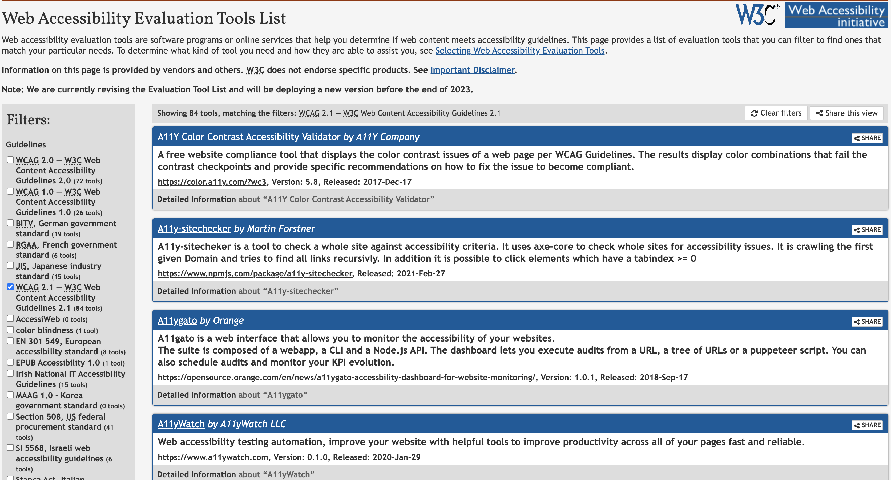
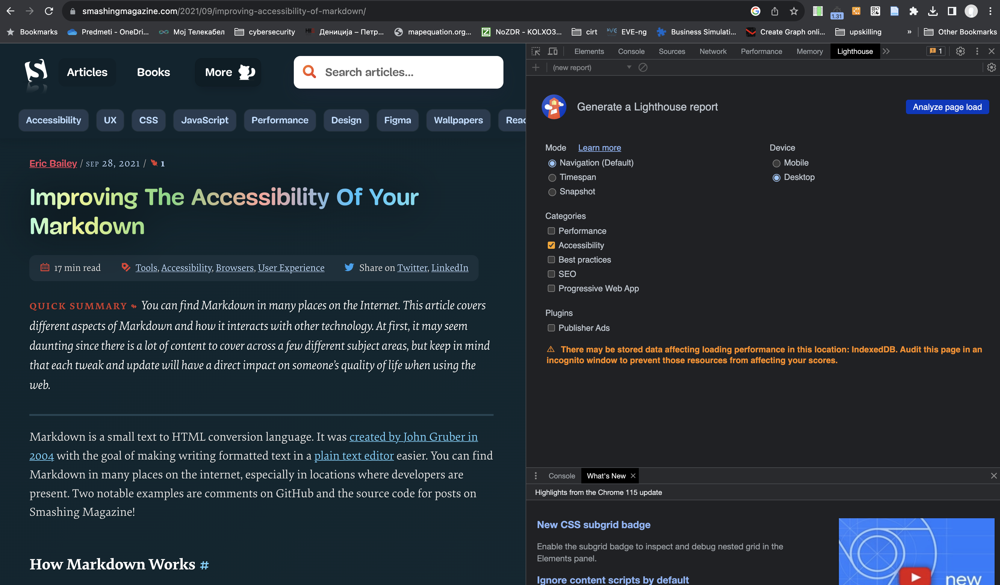
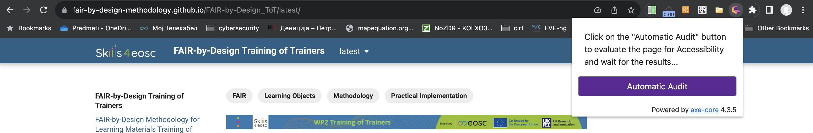
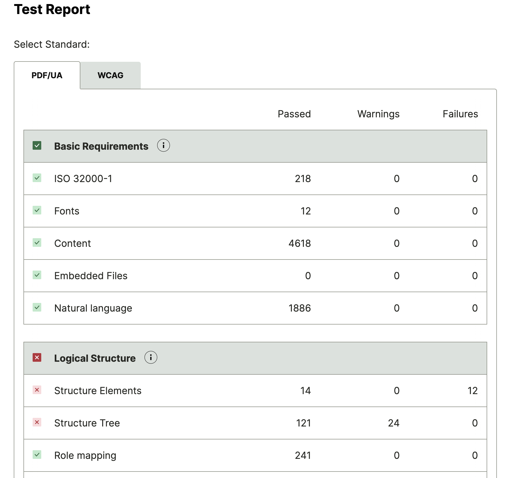
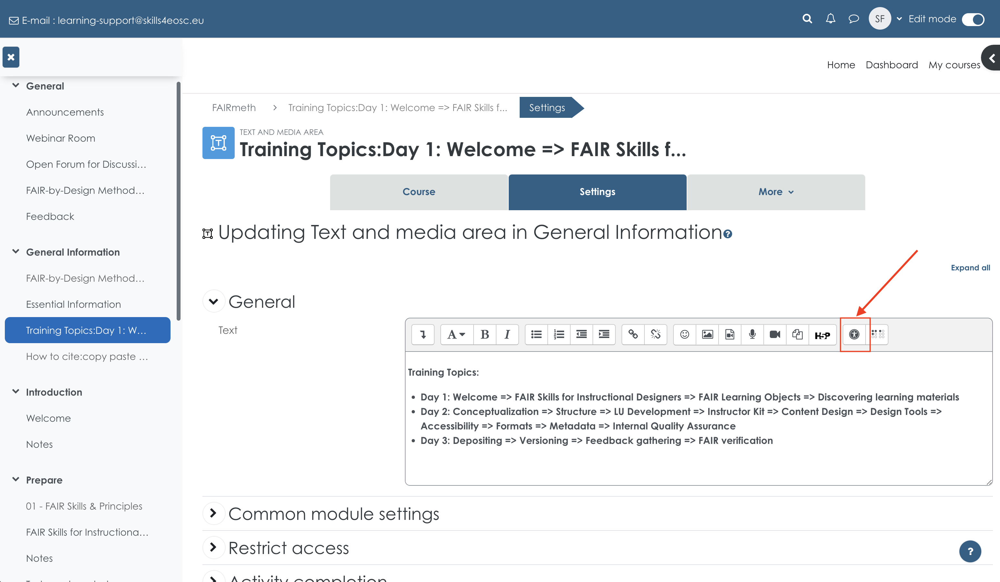

# Accessibility

All developed learning content should be accessible to a wide range of learners with different needs from a variety of backgrounds, abilities and learning styles. To ensure this the developed content needs to be checked so that access is optimised and all unnecessary barriers are removed making it inclusive and easier to engage with by all learners including people with disabilities. 

## Learning Objectives

- facilitate access to the learning content
- validate accessibility of the learning materials

## Target Audience

- attendees of the FAIR-by-Design ToT live webinar

## Duration

55 mins

## Prerequisites

Completed [09-Content Development](../09-Content%20Development/09-Markdown%20Syntax.md)
Completed [10-Content Mix](../10-Content%20Mix/10-Existing%20Markdown%20Materials%20Reuse.md)

## Learning Tools

- Training BBB room
- Power Point
- Chrome Browser
- LERA Chrome plugin

## Accessible learning materials

Accessible educational materials (AEM) are defined as educational materials that are designed or later enhanced in such a way that it makes them usable across the widest range of learner variability. For digital learning materials and technologies this means that they are accessible if they can be easily used by anyone, including people with disabilities. Accessible digital learning materials need to be designed so that they can be directly used without assistive technology or made usable with assistive technology. 

These are just a few examples that illustrate the need for accessible materials:

- simple text structure helps learners with a variety of learning needs, including learners for whom the language used is not their native language
- simple navigation through the materials should help access the content from mobile devices, as well as learners with low vision
- adding captions to videos helps learners with hearing impairment as well as learners that have low prior knowledge on the subject and key terminology.

### General guidelines for development of accessible materials

Most of the techniques used for development of accessible learning materials are based on the Universal Design for Learning (UDL) that focuses on the design of learning materials that are aimed to be inclusive of as many learners as possible. This approach, combined with the assistive and accessible technologies, can ensure that every learner has access to the same materials. 

UDL is based on three fundamental principles:

1. multiple means of representation
	- learning content should be presented in different ways and formats
2. multiple means of action and expression
	- several options for action and expression should support the demonstration of acquired knowledge
3. multiple means of engagement
	- learners differ in what engages and motivates them so multiple options should be provided

The following are some general guidelines that should help develop accessible learning content:

- **present the information in multiple ways and formats** - this helps support various learning styles and provides alternatives for different impairments
- **use simple language** - the materials should be accessible for the learners' varying levels of access, background, and ability
	- an option is to provide additional resources to support learners that have comprehension difficulties
- **use headings** - assistive technologies differentiate the structural elements in the text (body text and different levels of headings). These help screen readers process the text correctly.
- **use table of content** - helps learners navigate to the required information easily
- **provide alternative text for images** - the alternative text is read by the screen reader instead of the image. Decorative images should be marked as decorative so that the screen reader can skip them.
- **use equation editors for math expressions** - this format helps screen readers understand the content
- **use a high contrast color palette** - high contrast supports learners with vision impairments
- **don't use color as the only way to convey information** - provide other alternative means for color blind learners
- **use descriptive links** - links to other documents should explain where the link is taking the learner 
- **use tables only when required** - if a table is truly the best way to convey the information and not just a layout trick, then use column and row headers to describe the content
- **provide closed captions and transcripts** - to make the information in the video accessible to the vision impaired.

### Accessibility standards

The [European Accessibility Act](https://ec.europa.eu/social/main.jsp?catId=1202) (Directive 2019/882) requires product and services to be accessible for persons with disabilities, among which web sites and e-books. This also relates to the development of high quality digital learning material. In addition the [Digital Education Action Plan (2021-2027)](https://education.ec.europa.eu/focus-topics/digital-education/action-plan) focuses on the development of high-quality, inclusive and accessible digital education in Europe. Therefore it is imperative that the developed learning materials are as accessible as possible according to widely accepted standards. 

As the learning content created using this training approach will be mostly in HTML, PPTX and PDF format we are going to take a look at some standards that define what is accessible content for these formats.

#### The Web Content Accessibility Guidelines international standard

> The content of this subsection has been adapted from the [WCAG 2.1 recommendations](https://www.w3.org/TR/WCAG21) by [W3C](https://www.w3.org), [Copyright](https://www.w3.org/Consortium/Legal/copyright-documents) © 2017-2018 W3C® (MIT, ERCIM, Keio, Beihang).

The Web Content Accessibility Guidelines (WCAG) international standard developed by W3C defines how to make web content more accessible to people with disabilities. 

As the newest version WCAG 3 is still in its exploratory phase, and the latest version of this standard WCAG 2.2 has just been published in the beginning of October 2023, currently the active version of use is WCAG 2.1 with latest recommendations published in September 2023. Note that W3C always encourages the use of the most recent version of WCAG.

The WCAG standards are developed around a number (12-13) of guidelines that are organized under 4 principles: perceivable, operable, understandable, and robust. For each of the guidelines there is a defined success criteria that can be tested. The success criteria are defined as three levels: A (low), AA (mid) and AAA (high). In order to meet WCAG, the content needs to meet the success criteria (100%). Note that conformance at higher levels indicates conformance at lower levels.

Level A sets a minimum level of accessibility and does not achieve broad accessibility for many situations. For this reason, for the development of FAIR-by-design learning materials **we aim to achieve (as much as possible) WCAG 2.1 level AA**.

[WCAG 2.1](https://www.w3.org/TR/WCAG21/) define a number of new success criteria across the 4 principles:

- **Perceivable** - Information and user interface components must be presentable to users in ways they can perceive.
- **Operable** - User interface components and navigation must be operable.
- **Understandable** - Information and the operation of user interface must be understandable.
- **Robust** - Content must be robust enough that it can be interpreted by by a wide variety of user agents, including assistive technologies.

For Level AA conformance, the Web page satisfies all the Level A and Level AA Success Criteria, or a Level AA conforming alternate version is provided.

W3C provides a [quick reference](https://www.w3.org/WAI/WCAG21/quickref/) that describes what is needed in order to achieve conformance.

Some of the most important guidelines are as follows:

- Provide text alternatives for any non-text content so that it can be changed into other forms people need, such as large print, braille, speech, symbols or simpler language.
- The visual presentation of text and images of text has a contrast ratio of at least 4.5:1.
- Web pages do not contain anything that flashes more than three times in any one second period, or the flash is below the general flash and red flash thresholds.
- Web pages have titles that describe topic or purpose.
- The purpose of each link can be determined from the link text alone or from the link text together with its programmatically determined link context, except where the purpose of the link would be ambiguous to users in general.
- Section headings are used to organize the content.
- Captions are provided for all prerecorded audio content in synchronized media, except when the media is a media alternative for text and is clearly labeled as such.
- When the sequence in which content is presented affects its meaning, a correct reading sequence can be programmatically determined.
- ...

#### PDF/Universal Accessibility standard

> The content of this subsection is based on the [Overview of PDF/UA standard](https://accessible-docs.com/overview-pdf-ua-standard/) by [Accessible Document Solution](https://accessible-docs.com/).

Also known as ISO 14289, the PDF/UA standard defines clear normative terms for achieving accessibility for the PDF document format. The main goal of the standard is to enable people independently access all information provided in a PDF document. For these purposes the standard defines the content structure of PDF documents using a so-called tag-tree and how it can be access using assistive technologies.

Note that the PDF/UA requirements are complementary to the WCAG 2 success criteria, making them compliant with the requirements. 

The following are just a few of the technical requirements as set out by the PDF/UA standard:

- All real (meaningful) content shall be tagged. Artifacts (non-meaningful content) shall not be tagged.
- The “tag tree” created by the individual tags (representing the document’s content)  should be sorted to reflect the document’s logical reading order.
- All structure types in use shall be standard or mapped to standard
- A manual check of the document is required to ensure that there is no information conveyed using visual means alone (e.g. contrast, colour etc.), and that there is no flickering, blinking or flashing content.
- A document title must be given in the metadata. In the Document Properties, the Initial View settings must be set up so that the title (rather than the file name) appears in the window title (under Window Options).
- Any non-text elements (images, charts, graphs, infographics, logos, etc.) must have corresponding alternative text.

### Accessibility checking

Checking for accessibility of all generated learning content for learners is **required** if you are following the FAIR-by-design methodology.

Most of the success criteria and requirements of the accessibility standards can be programmatically checked using a special tool for these purposes. 

For the learners' notebook that is produced in an HTML format, the WCAG 2.1 AA conformance needs to be checked and this can be done by using any tool from the [Web Accessibility Evaluation Tools List generated by W3C](https://www.w3.org/WAI/ER/tools/?q=wcag-21-w3c-web-content-accessibility-guidelines-21).

Make sure that you use the filter on the left hand side to choose your **country guidelines** in case the developed materials need to follow them as well.

Many of the tools listed by W3C are free, however there are also commercial solutions, so use the filter on the left hand side to find the type of tool and license that works for you.

Note that when using multiple tools to check the same content, the reports generated by the tools may not be identical, i.e. the tools don't always agree on the accessibility success criteria outcomes. In other words, your web content may be declared as accessible by one tool, but not by another. Thus it is important to state the tool used and the report obtained when declaring that your content is accessible. 

In addition, **the accessibility evaluation tools are not almighty**. Thus it is best that a manual inspection is done in addition to the automated inspection using a tool. Some of the tools can even compile a list of the success criteria that require **manual inspection**.

#### HTML Accessibility Evaluation

Although the Chrome browser has a built-in accessibility checking tool as part of the [Lighthouse quality assessment tool](https://developer.chrome.com/docs/lighthouse/overview/), this accessibility check is very useful but not fully WCAG 2.1 compliant. It is very useful for dealing with basic accessibility issues of web content especially from styling and layout point of view. To check out Lighthouse you should go to View -> Developer -> Developer Tools. Then choose Lighthouse in the top ribbon of the left window that will be presented. Use the >> to access it. You can choose only to analyze the accessibility category. The analysis is activated with the Analyze page load button.

The accessibility checking tool that was used during the development of these learning materials is LERA, which is a free browser plugin for Chrome developed by AdvancedBytez Solutions Inc and released in February 2022.

To install the plugin you need to go to the chrome webstore and search for it, or you can use this [direct link to install LERA](https://chrome.google.com/webstore/detail/lera/neninfnjnhknniefcpognoooalfdaofc).

Once you have LERA installed, in order to use it, all you have to do is open a tab and navigate to the web page that you would like to inspect for accessibility. 

Then, you choose the LERA plugin from the list of extensions (you can also pin it for easier access) and click on the Automatic Audit button in the form that will appear.

A new window will be opened with the report created by LERA where on the dashboard the problems found are categorized in 4 categories: critical, serious, moderate, and minor.

In the example shown below, there have been 12 issues discovered related to two types of problems: 

- contrast between foreground and background colors
- links with discernable text

By clicking on the issues you can get more information on where they are, how big their impact is, and a recommendation on how to solve them. 

You can choose to save the reports for later reference. And if you go to Report on the left hand side you can download the saved reports in a Microsoft Excel format. 

If you are using the template repo as suggested in this training and are being careful to implement the general guidelines discussed before, there should be no problem to pass the automated audit performed by LERA.

#### Activity

Try checking the accessibility of the [NASA Transform to Open Science](https://nasa.github.io/Transform-to-Open-Science/) web site using LERA.

What are your findings? Do you have a clear idea of what changes are needed in order to pass the audit?

#### Power Point Accessibility

The power point presentations created for instructor led trainings should also be checked for accessibility issued. This can be performed by using the integrated tool called Accessibility Checker. 

Microsoft provides a web tutorial on how to [make your PowerPoint presentations accessible to people with disabilities](https://support.microsoft.com/en-us/office/make-your-powerpoint-presentations-accessible-to-people-with-disabilities-6f7772b2-2f33-4bd2-8ca7-dae3b2b3ef25#bkmk_acwin).

Within there is a list of best practices that should be followed while designing the presentation:

- every slide should have a meaningful title
- include alternative text for all visuals
- slide content should be read in the intended order
- descriptive hyperlink text should be used
- color should not be the only way of conveying information
- sufficient contrast should be used for text and background color
- tables should be avoided, or at least be simple with headers
- font size should be min 18pts
- sans serif fonts should be used
- integrated videos should be accessible
- export the presentation in an accessible format, e.g PDF

Although this list of best practices and checks that are implemented in Power Point are very similar to the success criteria defined in WCAG 2.1, it must be mentioned that Power Point does not formally conform to the WCAG 2.1 standard, meaning that if a presentation is deemed accessible by the checker it is not necessarily conformant to WCAG 2.1.

The Power Point Accessibility Checker can be activated in **Review** by choosing **Check Accessibility**.

The tool works in the Accessibility pane on the right hand side.

It shows a list of slides that have accessibility issues. Once you select a particular issue it provides recommendations on how to fix it in the bottom of the pane. 
The usual problems that arise are:

- not enough contrast
- small font size
- missing alternative text

Note that you should provide alternative text for every smart art that you use, and any other shape that you add to the slide. For the smart art, the alternative text can be the text from the smart art with some small adjustments.
Also, the tool can generate alternative text for you using AI, but it is not very good when it comes to complex images. 

Keep in mind that if you are using Quarto to develop your presentations, you MUST go through accessibility check in Power Point. Remember that Quarto uses the alternative text provided for an image as caption, so alternative text will need to be added manually for each image in the presentation.

Finally, if you are using Mac, then note that the simple use of Save As PDF feature does not create an accessible PDF. You will have to go to Power Point 365 online and open the presentation there and from there choose to export to PDF. With this you will get a PDF file that conforms to the very basic PDF/UA requirements.

#### Activity

Check the accessibility of the Power Point presentation on Open Science available on OSF: [Intro to Open Science - Panelist Slides for upload 3.3.18 at noon](https://osf.io/4nq5x/download) taken from [Introduction to Open Science: Nuts & Bolts of Getting Started](https://osf.io/24upq/) uploaded by [Elizabeth Gilbert](https://osf.io/h348c/). 

Have you identified all accessibility issues?
Are you able to solve them all?

#### PDF accessibility checking tool

The best way to ensure PDF accessibility is to use Acrobat Pro that has an integrated accessibility checker. Adobe has published a full [guide on creating and verifying PDF accessibility with Acrobat Pro](https://helpx.adobe.com/acrobat/using/create-verify-pdf-accessibility.html). 

Acrobat Pro however is a commercial tool that is not accessible to everyone and thus here we provide an alternative that enables you to check the accessibility of created PDF documents.

One free option is the [axesCheck online tool](https://check.axes4.com/en/) where you can upload a PDF file and the tool will provide you with a report on the compliance with PDF/UA and WCAG. 

As it can be seen in the images where an example PDF file has been used, the report provides a high-level overview of the passes and failed requirements. If you want to try and fix the issues you will need to use Acrobat Pro. Or try to go back to the source file from which the PDF was exported and fix some issues there.

Note that when exporting a Power Point presentation to PDF on Windows and on Mac, you will get a different output that will produce a different report in the tool. Accessible Power Point presentations (according to the built in checker) are usually converted into a PDF wherein all of the basic requirements for accessibility are fulfilled (as in the image above). This is the minimum that is required for the developed learning materials.

#### Moodle accessibility checks

The Skills4EOSC learning platform is based on the Moodle Learning Management System (LMS). If you are going to be adding content directly in the training course on the platform (not just linking to external resources such as the learner's notebook) then you need to make sure you check the accessibility of this content as well.

To perform this step you can use the integrated accessibility checker tool that is part of the ribbon of tools available when editing content in Moodle. This is usually the second icon from right to left that looks similar to the vitruvian man, as presented in the image below.

### Accessibility tips and tricks

As the main learning content is being developed in MD, the following are the best practices when it comes to MD accessibility:

- use headings to outline content
- provide meaningful alternative text for images
- use descriptive text for links
- use plain language

For tip on how to write alternative text for images study the [Alternative text guide by WebAIM](https://webaim.org/techniques/alttext/). The key takeaways in the guide include:

- alternative text should be accurate and equivalent in representing content and function
- alternative text should be succinct
- alternative text should not be redundant
- alternative text should not include phrases such as "image of ..." or "graphic of ..."

Decorative images should have blank alternative text. A decorative image is an image that

- does not present important content
- is used for layout or non-informative purposes
- does not have a function (e.g. is not a link)

When dealing with colors and layouts, there are online tools that can help experiment with color combinations. One such example is the [Elements must have sufficient color contrast](https://dequeuniversity.com/rules/axe/4.6/color-contrast) checking tool developed by Deque University. Using this tool you can check if you satisfy the AA or AAA levels for WCAG 2.1.

When you are reusing existing learning material, make sure to check the accessibility of this material as well. If there are any issues they should be fixed.

### Accessibility statement

If you are fully committed to accessibility and your complete web site provides accessible content, then you should develop an accessibility statement wherein you will provide details about your accessibility efforts.

The accessibility statement is usually presented as a link on the homepage that leads to separate accessibility policy page. There are many accessibility statement templates online that can be used to generate the accessibility statement. 

One of the best tools is the policy development guide developed by W3C: [Developing an Accessibility Statement](https://www.w3.org/WAI/planning/statements/) that defines all sections and information that should be present in the statement. It also offers a generator tool that will guide you through the steps and help you create your accessibility statement including all important aspects such as:

- mission
- measures to support accessibility
- conformance status
- feedback gathering
- compatibility
- technical specification
- limitations and alternatives
- assessment approach
- evaluation report and statement
- complaints response

The site also provides an [Example of Complete Accessibility Statement](https://www.w3.org/WAI/planning/statements/complete-example/).

Given that the learning materials that are to be developed within the Skills4EOSC project may need to conform to different country regulations and standards, and taking into account the inability to ensure PDF/UA compliance and WCAG compliance of the PPTX content, the approach to accessibility of the developed learning materials is best effort. This approach is stated within the accessibility mission provided in the syllabus.

## Summary

Checking and ensuring accessibility as much as possible using available tools and best practices is a requirement when aiming to achieve accessibility for FAIR learning materials.

It is important to adhere to standards such as the WCAG, but also follow the recommendations and rules defined on the country level. 

There are many options for using a WCAG accessibility checking tool, many of them freely available, and many editing tools and software such as Power Point come with integrated Accessibility Checkers that help produce inclusive learning materials starting from the design stage.

## Suggested Reading

- [Universal Design for Learning, Center for Teaching Innovation, Cornell University](https://teaching.cornell.edu/teaching-resources/designing-your-course/universal-design-learning)
- [WCAG Understanding Levels of Conformance](https://www.w3.org/TR/UNDERSTANDING-WCAG20/conformance.html#uc-levels-head)
- [Make your PowerPoint presentations accessible to people with disabilities](https://support.microsoft.com/en-us/office/make-your-powerpoint-presentations-accessible-to-people-with-disabilities-6f7772b2-2f33-4bd2-8ca7-dae3b2b3ef25#bkmk_acwin)
- [CENTERING DIVERSITY AND INCLUSION, THE OER STARTER KIT, Iowa State University Digital Press](https://iastate.pressbooks.pub/oerstarterkit/chapter/diversity-inclusion/)
- [WCAG conformance levels: How high should you aim?](https://www.levelaccess.com/blog/ada-compliance-levels/)
