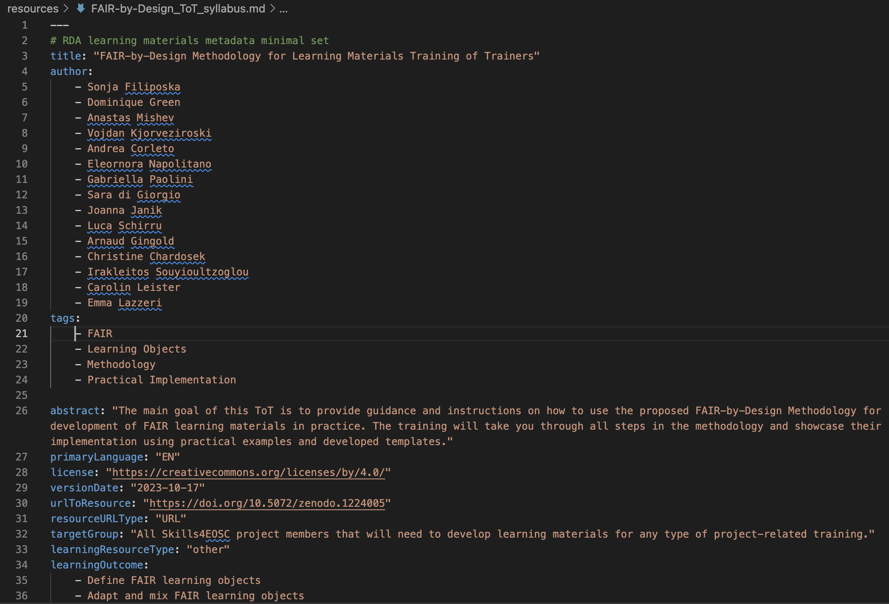

# Finalising content development

Using the tools and skills obtained in the previous learning units from this stage, you should be able to develop all learning materials that constitute a learning unit. The process is then iteratively repeated in order to develop all learning units in a similar fashion. Don't forget that you can combine learning units into modules and/or sections by placing them together in a folder. This organisation will be then visible in the learners' notebook. 

Once all learning units are completed it is time to complete the learning materials development cycle by finalising the last items: syllabus with metadata, license and facilitation guide.

## Learning Objectives

- create machine-readable metadata in syllabus
- generate overall license
- develop facilitation guide

## Target Audience

- attendees of the FAIR-by-Design ToT live webinar

## Duration

20 mins

## Prerequisites

Completed [Stage 3: Design](../../Stage%203%20–%20Design/04-Conceptualisation/04-Conceptualisation.md)
Completed [11-Accessibility](../11-Accessibility/11-Checking_accessibility.md)

## Learning Tools

- Training BBB room
- Obsidian

## Final learning content editing 

The final touches when it comes to learning content definition are to be done once all learning units are fully completed. These last steps include:

- review of the syllabus and adding machine-readable metadata
- replacing the license file (if needed)
- defining the facilitation guide

Note that **we do not recommend changing the Feedback form**, so that there is uniformity of the way the feedback is gathered accross trainings. This will make the process of reporting on the training events a lot more easier. However, for national trainings it might be prudent to localise the feedback form to the native language of the trainees. For these purposes the localisation should be done on the Skills4EOSC learning platform. 

### Syllabus and machine-readable metadata

The content of the syllabus was defined during the Design stage. If you have not entered this content into the provided syllabus template file then it is time to do so. While editing the main content of syllabus file in Obsidian ensure that any changes or adaptations you have done during the iterative process of development of learning units is reflected in the final content of the syllabus.

Remember that the syllabus contains all fields defined with the RDA minimal metadata schema thus providing all required information in a human-readable format.

Now it is time to provide the same information in a machine-readable format. For these purposes you need to edit the metadata of the syllabus md file. 

The metadata portion of the file is at the top of the document between the set of ---. It consists of a list of keywords and values where each keyword represents a field from the RDA minimal metadata schema.

Note that # is used to represent a comment, and that the first three keywords are named a little bit differently (tags are keywords) so that they are compliant with the md metadata standards and recognised by the system that generates the web content.

Fields that have one value only, should have that value represented between quotation marks. For fields that can have multiple values, each value is supplied in a separate row using 4 spaces and - in front. Don't mix spaces and tabs as this will break the format and the content will not be machine parsable.

To fill out the syllabus md file metadata you can simply copy and then paste the corresponding content from the main syllabus body below.

### Updating the License

If you have been creating your own repo from scratch or cloned the templates repo, most probably the current license you have in your repo at the moment is CC0. If this is the license that you have decided to use during the Design stage all is ok and you can skip this subsection.

If during Design you have decided that you will use another license (compatible with the reused material, derived using the adapter's license rules, etc.) then you need to replace the LICENSE file in your repository with the correct one. We are assuming that you already wrote the correct license in the syllabus file while working in the previous section. 

To do this you need to perform the following steps:

1. Find and download the correct plaintext version of your license
    - [Plaintext versions of Creative Commons 4.0 licenses](https://creativecommons.org/2014/01/07/plaintext-versions-of-creative-commons-4-0-licenses/)
2. Open the downloaded legalcode.txt file
3. Select All and Copy its content
4. Open the LICENSE file in your repo
5. Select All and Paste the content of the legalcode.txt overwriting the old content
6. Save the new content of the LICENSE file
7. Commit and Push the changes
7. Go to your repo on GitHub
8. Check the license information on the right-hand side in About

### Defining the Facilitation Guide

The final learning content that needs to be developed is the overall Facilitation Guide. This document was introduced in the Design stage where its structure was defined. A guiding template has also been prepared for this document which can be found in the templates repository under the name [template_faciliator_guide.md](https://github.com/FAIR-by-Design-Methodology/templates/blob/main/resources/template_facilitator_guide.md).

Rename the file by replacing the word template with the name of your training, and edit its contents so that it can describe the specifics of the training you are preparing. 

If you are looking for inspiration, you can take a look at the [facilitation guide prepared for this training](https://github.com/FAIR-by-Design-Methodology/FAIR-by-Design_ToT/blob/main/resources/FAIR-by-Design_ToT_facilitator_guide.md).

### Activity

Follow the steps described in this learning unit and try to:

- update the metadata of your syllabus file
- change the LICENSE
- edit the Facilitation Guide

## Summary

The development of learning materials is an iterative process that may include many back-and-forths between the already developed learning content and content that is currently in development. 

At the final end of the learning content editing stage it is necessary to ensure that the syllabus is up to date and that its metadata reflects the content defined in its body. Also make sure that the LICENSE file you use is correct and that you have prepared an overall facilitation guide for the upcoming training that is based on the developed learning materials.

## Suggested Reading

- [YAML metadata in markdown](https://peterbabic.dev/blog/yaml-metadata-in-markdown/)
- [Add or Change a license on GitHub](https://dev.to/kasuken/add-or-change-a-license-on-github-1k53#:~:text=From%20your%20repository%20on%20GitHub,https%3A%2F%2Fchoosealicense.com%2F.)
- [How to Create a Facilitator’s Guide to Deliver Better Instructor-Led Training + Examples](https://www.workramp.com/blog/creating-facilitator-guides-to-deliver-better-instructor-led-trainings/)