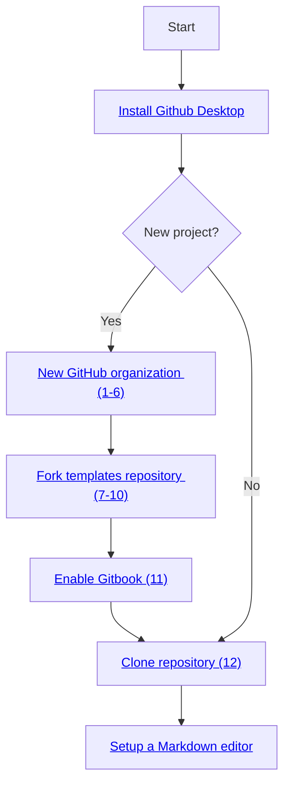

# Team Collaboration

Before starting work on the production on actual FAIR-by-Design learning materials, it is worth reiterating all of the steps which are advised in order to ensure a seamless collaboration environment with multiple contributors. Most of what is described in this unit has already been mentioned previously, but this page should act as a reference for any future environment setups.

## Learning Objectives

- Recognize the need for a GitHub organization when collaborating with others
- Differentiate between organization level and repository level repository permissions
- Use the GitHub web portal to add collaborators to an existing organization or repository
- Solve potential change conflicts arising when multiple authors make changes to the same file concurrently

## Target Audience

- Attendees of the FAIR-by-Design ToT live webinar

## Duration

15 mins

## Prerequisites

All previous units in the [Stage 4: Produce](../../Stage%204%20–%20Produce/08-Development%20Tools/08-Introduction%20to%20Markdown%20and%20Git.md), including [13-Internal QA](../13-Internal%20QA/13-Internal_QA.md).

## Learning Tools

- Training BBB room
- Obsidian

## Preparing the Collaborative Environment

The following steps are to be followed by a single contributor who will establish the GitHub organization, fork the [templates](https://github.com/FAIR-by-Design-Methodology/templates) Git repository, and then invite all remaining collaborators. Once granted access, the collaborators will simply need to clone the new repository and start working on the materials themselves. We assume that general knowledge of Git terminology and access to previously discussed software tools including GitHub Desktop and Obsidian.

1. Login to GitHub and create a new organization by clicking on your profile picture in the top right corner and selecting `Your Organizations`. Initiate the new organization wizard by clicking on the `New organization` button.
2. You will be asked to select a GitHub plan for your new organization. The `Free` plan includes everything that might be needed for the development of FAIR-by-Design learning materials, including hosting of a Git book. The `Free` plan is equivalent to the `Team` plan when it comes to public repositories, so that is what we will be using shortly. Choose the `Free` plan by clicking on the `Create a free organization button`.

    

3. Enter the organization name and contact email.
4. If desired, search and add collaborators to the organization. There is always an option to add additional collaborators at a later stage. An important distinction that needs to be made is between collaborators at the organization level and collaborators at the repository level. If you plan to develop multiple distinct FAIR-by-Design courses, each in its own repository, with perhaps a different set of collaborators, then per-repository collaborators are the right choice for you. Repository level collaborators only have access to a single repository, which is in contrast to organization level collaborators which have access to all existing and future repositories part of a given organization. Make a decision on your collaborators' strategy and if needed, invite the respective organization level collaborators now by either entering their GitHub username or email address. If no organization level collaborators need to be added at this moment, choose `Skip this step`.

    

5. After a couple of moments your organization will be created and you will be redirected to its homepage. Make sure that the organization's visibility is set to `Public` using the dropdown menu in the top right corner.

    

6. If at any point in time additional organization level collaborators need to be added, this task can be accomplished from the `People` page, using the `Invite member` button.

    

7. The next step is to fork the [templates](https://github.com/FAIR-by-Design-Methodology/templates) repository under the new organization. Navigate to the [templates](https://github.com/FAIR-by-Design-Methodology/templates) homepage, and click on the `Fork` button.

    

8. Using the repository forking wizard, make sure to select the newly created organization as the repository owner. Enter a desired name for the new repository and provide an optional description.

    

9. After a few brief moments the forking process will complete and you will be redirected to the homepage of the newly created repository. 
10. Repository level collaborators can be added at this point using the `Settings -> Collaborators and teams` page.

    

11. Make sure that the automated workflow will have the necessary permission to build the Git book by navigating to your organizations homepage, then choosing `Settings -> Actions -> General`. Scroll down until the `Workflow permissions` section becomes visible. Choose `Read and write permissions` and save the changes.

    

12. At this point all collaborators will get an email notification alerting them of their new role within the organization/repository. They can proceed by cloning the repository using the GitHub Desktop software, as discussed in [08-Introduction to Markdown and Git](../08-Development%20Tools/08-Introduction%20to%20Markdown%20and%20Git.md#step11).

13. Stepping away from technical matters for a moment, it is best if you take a moment to discuss with your collaborators who will be working on what learning units, dividing responsibilities as to avoid any potential conflicts. If Git conflicts (called merge conflicts) do happen, read the [Advanced: Resolving Git Conflicts](./14-Team%20Collaboration.md#advanced-resolving-git-conflicts) section below to learn how to resolve them.

## Syncing Changes from the Templates Repository to the Fork

As continuous improvements are done to the templates repository (i.e., automated workflows), it is recommended that any forks are continuously kept in sync, as to leverage these improvements. One of the core features of Git is to allow such easy reconciliation of changes between related repositories. The steps for doing so are:

1. Check if any changes have been made to the parent `templates` repository since the fork was created. Navigate to the homepage of your forked repository and check if a banner message appears with the text `...x commits behind...`. If no such banner message appears, then the forked version is up-to-date and no further steps need to be taken.
2. Click on the `Sync fork` button to incorporate the changes. If no conflicting changes are detected (both the parent and the forked versions have made changes to the same parts of a given file) a green `Update branch` button will appear.

    

    **Warning:** Please note that the `Discard commits button` should not be clicked, since it will remove any changes made to your repository since it was forked, bringing it to the same state as the parent repository.

3. In case conflicting changes are detected, it will not be possible to automatically reconcile the two repositories and manual action will be needed. This should be a rare occurrence since changes to the `templates` repository are usually confined to the workflows placed in the `.github` directory. Nevertheless, if such a situation does arise, please have a look at the [Advanced: Resolving Git Conflicts](#advanced-resolving-git-conflicts) section below.

## Cheatsheet 

To further ease the process of creating new projects based on the FAIR-by-Design templates repository as well as to simplify the onboarding of collaborators, the visualization bellow outlines all of the steps that need to be performed:
    a) initially, during the environment setup
    b) by each collaborator individually

The numbers in brackets refer to the steps in the Section [Preparing the Collaborative Environment](#preparing-the-collaborative-environment), above.

## Advanced: Resolving Git Conflicts

One of the best Git features is its ability to provide users an easy way of resolving change conflicts. A change conflict occurs when two (or more) users simultaneously edit the same portion of a given file, and then try to commit it. Note that if distinct parts of the same file are edited, and there are no conflicting changes, then Git is able to merge the changes automatically, without requiring a user intervention. A user intervention is required only when Git is not capable of reconciling the changes, and the user is asked for an input on what changes to keep and what changes to discard.

In case a change conflict does occur, Git will explicitly mark all conflicting changes in the file, allowing the user to resolve them on a case-by-case basis, and then commit the latest version of the file again. Such advanced change conflict features are only available on plain text formats, such as `.md`, `.txt`, or source code files. Binary files such as `.docx` or `.pptx` cannot have conflicts resolved with the help of Git.

Let's look at an example under what conditions a change conflict can occur and how to resolve it. We assume that two contributors, Bob and Alice, want to collaborate in a single repository. Both Bob and Alice start by updating the `syllabus.md` file, and they both change the metadata in the Markdown header. Bob manages to commit the changes first and pushes them to the upstream repository. When Alice is satisfied with her changes, and tries to commit and push them, she received the following error message:

As discussed in previous sections, this message does not necessarily mean that there is a change conflict that will require manual intervention. Maybe the changes are made do distinct, non-overlapping, parts of the files, so let's fetch (download) them.

After fetching, we have the option of applying the changes using the `Pull origin` button.

At this point, if the changes are indeed in conflict with one-another, we will be presented with an error message such as the one shown below.

The `Continue merge` button will remain deactivated until all conflicts are manually resolved. Let's get back to Obsidian and see the state of our `syllabus.md` file.

Notice the two code blocks which have been selected using orange and blue boxes respectively. The orange block, starting with `<<<<<<< HEAD` is the change that Alice has done (the local change). The change denoted by the block starting with `=======` and ending with `>>>>>>>>` is the remote change (done by Bob), identified by the unique change number, `fcb...`.

Now it is up to Alice do decide how to proceed. She can either discard her own change (removing the content in the orange box), discard Bob's change (removing the content in the blue box), or do a manual merge. Let's assume that Alice opts to do a manual merge. After editing the file, it will look similar to what is shown in the figure below.

Note that the extra lines containing characters such as `>>>>>`, `=====`, `<<<<<<` which were used to denote the start and end of the conflicting changes have been manually removed.

Going back to GitHub Desktop, we can see that the change conflict has been resolved, and we are ready to continue. 

In the background clicking on the `Continue merge` button will automatically commit our changes, so the only thing remaining now is to push these changes to GitHub.

## Key Takeaways

It is important to have a well-defined and clear development workflow when collaborating with multiple contributors on learning materials. Nonetheless, conflicting changes can happen in the real world, and Git with its robust change tracking can help resolve such situations. An important thing to keep in mind is that conflict resolution only works on text-based file formats, such as Markdown, which can also be seen as an additional advantage to using this open format for learning material production.