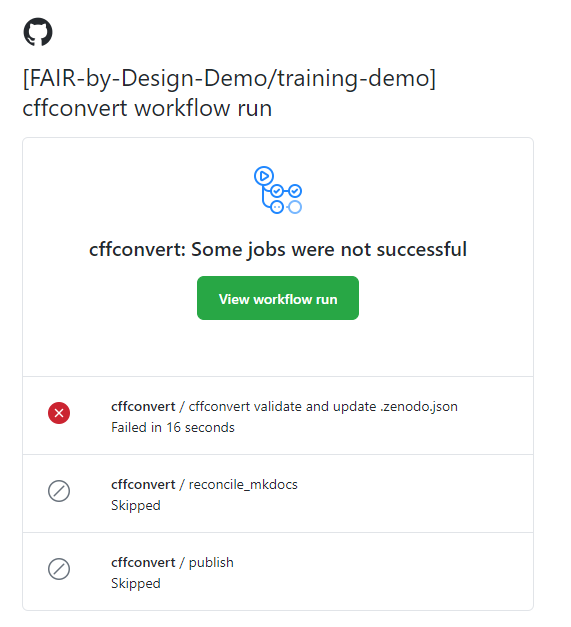

# Publishing Preparations

Before publishing the learning materials on Zenodo and other platforms, it is important to go over all of the accompanying files in the Git repository that might contain pieces of metadata and update them accordingly. 

## Learning Objectives

- Recognize the various accompanying files that need to be present in the Git repository before moving forward to formal publishing of the materials
- Describe relevant software tools required for creating and validating the accompanying files
- Develop appropriate accompanying files for custom repositories hosting FAIR-by-Design learning materials

## Target Audience

- Attendees of the FAIR-by-Design ToT live webinar

## Duration

35 mins

## Prerequisites

[Stage 4 – Produce](../../Stage%204%20–%20Produce/08-Development%20Tools/08-Introduction%20to%20Markdown%20and%20Git.md)

## Learning Tools

- Training BBB room
- GitHub Desktop
- Obsidian
- Text editor

## Preparing the Collaborative Environment

In this unit we will go over the important files that will need to be manually updated before publishing the materials for the first time on Zenodo and other platforms. All of the steps discussed below will need to be manually executed only once, upon the first publishing of the materials.

Closely following the provided instructions is very important before moving forward with the actual depositing on Zenodo which is handled by automatic workflows, as discussed in [17-Zenodo Publishing](../17-Zenodo%20Publishing/17-Zenodo%20Publishing.md)

## Files Description

The [FAIR-by-Design templates repository](https://github.com/FAIR-by-Design-Methodology/templates) contains the accompanying files which we will need to alter:

- CITATION.cff
- README.md
- CODE_OF_CONDUCT.md

These files can be altered in any order desired, as long as making sure that they have all been covered. Starting from `CITATION.cff`, the purpose of this file is to provide information on how the Git repository can be cited. Its content, among other things, also controls the text shown when the `Cite this repository` button is clicked on the right hand side of a GitHub repository's homepage. It is written in a YAML format and has controlled vocabularies for most of the supported fields. Luckily, validators are also widely available, and we will discuss some options in this space in the Activity, below.

`README.md` is a Markdown file which should briefly describe the repository, so that first time visitors can get an initial idea what it is about. The README.md file's content is shown immediately below the directory browser on the repository's homepage.

The `CODE_OF_CONDUCT.md`, as its name suggests, describes the contributors' code of conduct which needs to be adhered to. It defines standards for how to engage in a community. It can also contain steps for resoling issues between members of the community. GitHub also shows a direct link to a repository's code of conduct (if available) above the citation information.

In the activity that follows we will go over all of the required changes that need to be made to these files, along with tips, and any potential pit-falls when it comes to controlled vocabulary fields.

## Activity: Publishing Preparation in Practice - Customizing Accompanying Files

### Setting up the Environment

- Make sure that the latest changes have been pulled from the remote using the GitHub Desktop application
- Open the Obsidian workspace
- Ensure that all three files are already available (as a result of forking the templates repository previously) in the root of the repository: `CITATION.cff`, `README.md`, `CODE_OF_CONDUCT.md`.

### Filling out CITATION.cff

- Click on `CITATION.cff` in Obsidian's file tree pane. In some environments Obsidian might not be able to automatically open the file since it has an unsupported extension - `.cff`. If so, select a preferred text editor which is already installed on your system (e.g., Notepad on Microsoft Windows).
- Fill out the appropriate information in the following fields:
    - `authors` - a list of authors who participated in the creation of the learning materials
    - `title` - title of the training
    - `abstract` - a short abstract describing the learning materials
    - `license` (if a license other than the default CC-BY should be used)
    - `license-url` (if a license other than the default CC-BY should be used)
    - `keywords` - list of keywords which describe the learning materials
    - `repository` - the URL to the GitHub repository where the materials are hosted

    While filling out the file and adding new lines, make sure that they match the indentation of the examples. The picture below provides a visual example of how to correctly add a new author.

    

    The newly added author (an imaginary John Doe) should have the same indentation (number of spaces at the beginning of the line) as the first author which is given as an example in the template. Inconsistent number of spaces will make the CITATION.cff file invalid. Additionally, we denote that we are adding information about a new author by prefixing the first property (in this case `family-names`) with a `-` character.

- Note that any other fields also present in the `CITATION.cff` file such as: `version`, `doi`, `date-released` **should not be manually edited**. They will be updated automatically when publishing the repository to Zenodo.
- After having done the necessary updates to the fields, you can validate the structure of the `CITATION.cff` file using the free online utility which is available on [citation-file-format.github.io](https://citation-file-format.github.io/cff-initializer-javascript/#/update).
    - Paste the content into the text field
    - Press the `PARSE` button
    - Ignore any warnings about "extra" fields. It is important that a message stating `Parsed CFF successfully` appears.

        

        In case there is a validation error, a descriptive error message will be shown, pointing to the line that is incorrectly formatted. Assuming that the correct indentation policy is not followed when specifying the first name of an author, the error message will be:

                

- Save the changes made to the `CITATION.cff` file and close the text editor.

### Filling out README.md

- Go back to Obsidian and open the `README.md` file by clicking on its name from the left-hand directory tree.
- Luckily, the content of the README.md file is free text, so you are welcome to provide any introduction that you would like. Just make sure to keep the official Skills4EOSC header image, and a reference to the templates repository (only if desired, as a result of the CC-0 license).

### Filling out CODE_OF_CONDUCT.md

- The `CODE_OF_CONDUCT.md` file, as present in the templates repository is a generic text that can be applied to any future trainings. 
- Go over the text and make any desired changes.
- Make sure to alter the contact information for the person responsible for the enforcement of the code of conduct rules, specified in the `Enforcement` section.

### Committing Changes

Once the three files have been updated, commit the changes and push them to GitHub using the GitHub Desktop application. Upon every change of the `CITATION.cff` file an automated action is executed which verifies its contents. In case of a validation error, you will receive an email message similar to the one shown below.

The recommended action in such cases is to simply retry the validation of the `CITATION.cff` file manually using the [citation-file-format.github.io](https://citation-file-format.github.io/cff-initializer-javascript/#/update) tool. Make sure to address any errors, committing and pushing the results to GitHub once completed.

## Key Takeaways

We have manually prepared all of the necessary metadata required for a successful first publishing of the created learning materials. Most of the steps described in this learning unit will need to be performed only once or in some cases rarely (e.g., when adding a new author). We will leverage this metadata information in the [next learning unit](../17-Zenodo%20Publishing/17-Zenodo%20Publishing.md) where we will create our very first Zenodo deposit.

## Suggested Reading

- [Citation File Format (CFF)](https://citation-file-format.github.io/)
- [CITATION.cff Controlled Vocabularies](https://github.com/citation-file-format/citation-file-format/blob/1.2.0/schema-guide.md)
- [About READMEs on GitHub](https://docs.github.com/en/repositories/managing-your-repositorys-settings-and-features/customizing-your-repository/about-readmes)
- [Adding a Code of Conduct to Your Project](https://docs.github.com/en/communities/setting-up-your-project-for-healthy-contributions/adding-a-code-of-conduct-to-your-project)