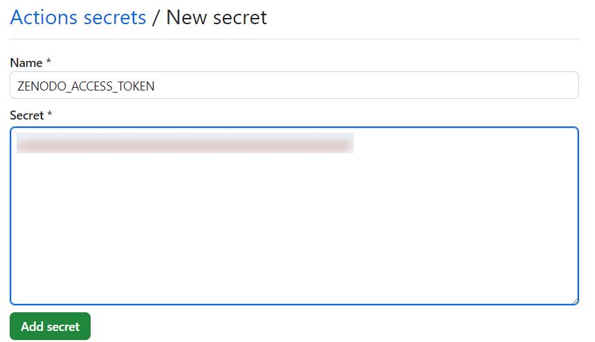
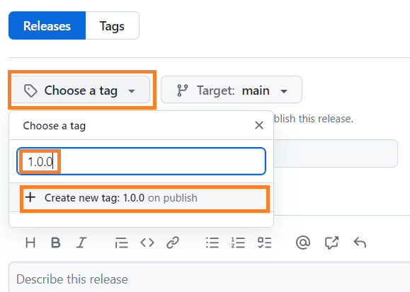
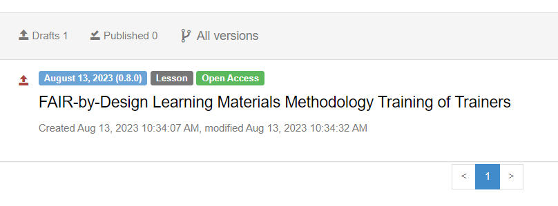

# Zenodo Publishing

One of the publishing media for the created learning materials is Zenodo. Zenodo is a general purpose repository which also assigns a DOI to each submitted entry.

## Learning Objectives

- Describe the automated workflows for publishing the Git repository on Zenodo
- Author new version releases of the learning materials
- Examine draft publications on Zenodo

## Target Audience

- Attendees of the FAIR-by-Design ToT live webinar

## Duration

55 mins

## Prerequisites

[16-Publishing Preparations](../16-Publishing%20Preparations/16-Publishing%20Preparations.md)

## Learning Tools

- Training BBB room
- GitHub Desktop
- Obsidian

## Description of the Automated Publishing Workflow

The [templates](https://github.com/FAIR-by-Design-Methodology/templates) repository includes existing workflows which when triggered automate the complete Zenodo publishing process. These workflows are generic and also apply to any forks, without the need for any manual changes. In a nutshell, the actions performed by these workflows are:

- validate the metadata information provided in `CITATION.cff` and update the fields which are automatically managed (`doi`, `version`, `date-released`)
- create a draft entry on Zenodo, prereserving a DOI
- update files in the repository which should reference the DOI (the syllabus, last slides of all PowerPoint presentations, `CITATION.cff`)
- rebuild the Git book, reflecting the version and DOI changes (for example the cite information in the footer)
- release a new version of the Git book

We will go into more details about each of the workflow steps as well as how to trigger them in the activities below. 

## Activity: Creating a Draft Deposit on Zenodo

The goal of this activity is to describe the way in which the automated publishing workflow is triggered and to verify the resulting Zenodo draft.

**Notice:** Feel free to follow these steps without any hesitation. The workflow will only create a draft deposit on Zenodo, meaning that it will not be publicly published without your explicit approval which can be given from the Zenodo web interface.

### Double-checking whether the Workflows Configuration

1. Make sure that the workflows which have been copied from the upstream `templates` repository during the forking process are indeed enabled.

    i. Visit the homepage of the fork
    ii. Navigate to the `Actions` tab
    iii. If there is a big green button for enabling the copied workflows, click it. If the green button is missing and instead a list of available workflows is shown on the left-hand side of the screen, it means that the workflows have been enabled as required as part of the previous learning units.

    The image below shows an example list of available workflows which should be shown once they have been enabled.    

    

### Authorizing the Workflows to Use Zenodo

In order for the automated actions to be able to create a draft Zenodo deposit, we must generate an authentication token.

1. Navigate to [Zenodo](https://zenodo.org) and register a new account or login with an existing one.
2. Once logged in, click on the dropdown menu next to the profile button and select `Applications`.

    

3. In the `Personal access tokens` section click on the `New token` button.

    

4. Enter an arbitrary name for the token and make sure to only check the `deposit:write` checkbox in the `Scopes` section. Click on `Create`.

    

5. Copy the generated access token shown in red. We will need it in a moment. Please note that the token itself is sensitive information, so make sure not to share it with anyone else.

    

6. Go back to the homepage of your GitHub repository. Click on the `Settings` tab.
7. Click on `Secrets and variables` -> `Actions` in the navigation menu on the left.

    

8. Click on the green `New repository secret` button. Enter `ZENODO_ACCESS_TOKEN` as the name and the copied value from previously as the `Secret` value.

    

9. Save the new secret using the `Add secret` button.

### Creating the Very First Zenodo Deposit

We are now ready to initiate the automated workflow for submitting the first draft deposit to Zenodo.

1. Navigate to the homepage of the Git repository. On the right-hand side click on the `Releases` section.

    

2. Click on the green `Create a new release` button.
3. Click on the `Choose a tag` dropdown. Enter the desired version number (e.g., 1.0.0). Make sure to use three numbers, as per the [Semantic Versioning specification](https://semver.org/). The first number (also known as major version number) should be incremented in case of major changes or a complete rewrite of the material. The second number (also known as the minor version number) should be incremented when smaller changes are made, such as extending existing learning units with additional content, or adding a new learning unit. The third and last number (also known as the patch version number) should be incremented when the changes do not directly impact the learning content itself and are constrained to technical changes such as fixing typos, adding references, or improving formatting. 
4. Click on the `Create new tag: 1.0.0 on publish` option.

    

5. Enter the same version number in the `Release title` field.
6. Provide an optional description in the `Describe this release` field. This is a free-text field, so you are free to enter whatever text you would like.
7. Create the release by clicking the green `Publish release` button.
8. At this moment the automatic publishing workflow will be triggered. You can follow its progress from the `Actions` page. Wait until a green checkmark appears next to the latest entry in the `Actions` list. In case of any errors you will receive an email message.

### Verifying the Zenodo Deposit

Once the workflow has been successfully executed, it is time to verify the changes that it has made to the repository, together with the uploaded draft deposit on Zenodo.

1. Navigate to the Git book homepage, and check the cite footer. Note that the citing information has been updated and it now references the latest published version, as well as the correct DOI.
2. Notice that at the top of the Git book homepage the version dropdown includes a new version - `1.0.0`. This is a point-in-time freeze of the content of the repository as it appeared at the time of the release. Any future changes will not be applied to the `1.0.0` version of the Git book and will instead be reflected only in `latest`.
3. Verify that the correct DOI appears on the landing (syllabus) page of the Git book.
4. Using the GitHub Desktop client pull the remote changes which have been committed and pushed during the workflow's execution.
5. Open any PowerPoint presentation at random. Navigate to the last slide. Verify that the citing information correctly references a new DOI.
6. Navigate to [Zenodo](https://zenodo.org) and click on the `Upload` button in the header, next to the search bar.
7. You will be presented by a draft deposit of your Git repository.

    

8. Note that this draft deposit is still not publicly accessible, but has a DOI pre-reserved which has not been activated. Click on the deposit's name. 
9. Verify that all metadata has been correctly transferred from the Git repository. Note that you will not be able to make any changes to the deposit once published. Pay special attention to the associated Zenodo community, authors, license, and funding information.
    - **Important:** The only ***manual*** change that needs to be performed is to enter the correct language in the `Language` field.
10. When satisfied with the deposit's metadata information, scroll down to the bottom of the page and click on the `Save` button.
11. The deposit can be made public by clicking on the `Publish` button. **Please note that publishing the deposit is an irreversible action.**
    - Once published, you will be redirected to the deposit's homepage on Zenodo.

## Key Takeaways and Information for Future Versions

We have published the first version of our FAIR-by-Design training. The same steps can be followed for any future version releases. Note that once set, the provided Zenodo secret will not need to be changed or modified in any way from the GitHub web interface. When publishing a newer version of the materials, the workflow will automatically link it to the previous version, so that there is continuity between them, making it easier to view versioning information at a glance from the Zenodo web interface.

## Suggested Reading

- [Semantic Versioning](https://semver.org/)
- [Zenodo REST API](https://developers.zenodo.org/)
- [Creating Encrypted Secrets for a Repository on GitHub](https://docs.github.com/en/actions/security-guides/encrypted-secrets#creating-encrypted-secrets-for-a-repository)
- [Zenodo Frequently Asked Questions](https://help.zenodo.org/faq/#general)