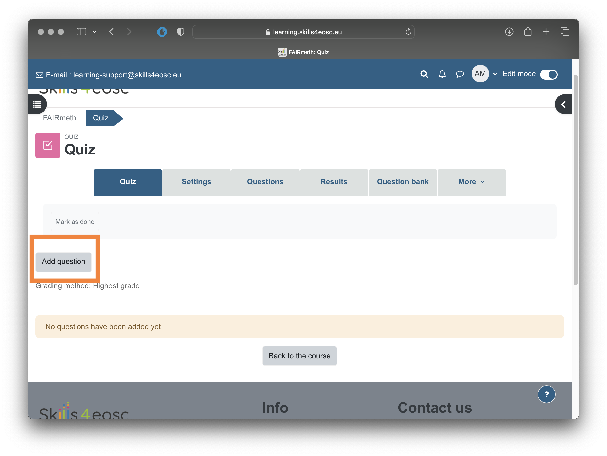
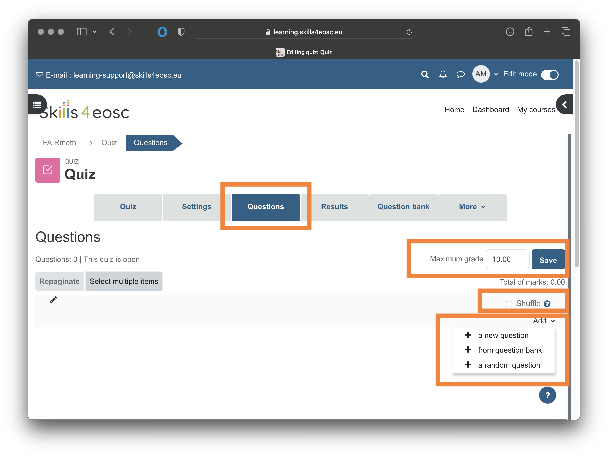

#  Publishing to learning platform

The learning materials targeted for consumption by the learners/trainees are usualy deposired in on the learning platforms, usually as parts of larger learning units such as courses.

## Learning Objectives

- Describe the procedure for publishing learning materials to the learning platform
- Using Moodle as prefered learning platform, explain the basic elements of the course
- Configure Moodle course parameters
- Add different elements to the course

## Target Audience

- Attendees of the FAIR-by-Design ToT live webinar

## Duration

35 mins

## Prerequisites

[16-Publishing Preparations](../16-Publishing%20Preparations/16-Publishing%20Preparations.md)

## Learning Tools

- Training BBB room
- Moodle lerning platform

## Description of the procedure for publishing to the learning platform

In this course we will be using the Skills4EOSC learning platform, available at [learning.skills4eosc.eu](https://learning.skills4eosc.eu). The learning platform is based on the popular and widely used open source learning managemet system (LMS) called [Moodle](https://moodle.org).
The initial step needed to publish a course at the learning platform is to request one from the platform's adminstrators. 
> NOTE: Before asking for the course creation, please create an account on the platform, using the "Log in" link at the upper right corner of the welcome page. 

To do so, write an email to [learning-support@skills4eosc.eu](mailto:learning-support@skills4eosc.eu) requesting the creation of the new course, as well as stating the names/emails of the people that will be assigned Trainer (Teacher) role of the course.
>NOTE: At least one person should be assigned the role Trainer (Teacher), allowing her/him to add more teachers to the course later. 

Once the course has been created, you can start customizing it and publishing the learning materials. 

### Configuring course parameters
The first action usually taken to a new course is to customise its settings. To customise settigns, one must have the Teacher (Trainer) role assigned. 

The main parameters that can be set are: Course full name, Course short name, Course visiblity, Course start and end date etc. 
>NOTE: Initially, Course visibility is set to Hide during the preparation of the course. This means that the Learnerns/Trainees can not see or access the course. 

Other parameters that could be set for a course include Course summary and image in the Course decsription section, that are displayed in the coruse list or dahboard.
To customise the way the course material is presented to the trainees, use the settings unde the Course format section. The Format parameter lets you choose between several format, including Weekliy format (sutaible for courses that are offered at the specific time, where material is grouped by weeks) or Topics format (where eachs section of the course is one topic). For courses that are offered as self learing courses, the Topic format is preferable. 

Defining tags for the courses helps the users discover the course when searching through the courses offering on the learning platform. 

### Creating course structure
When the course has been configured to be in the Topic format, the structure of the course consists of one General topic (created by default when creating the course) and number of Topics. Each topic is a contanier that will have different learning objects within. 

To make any changes to the courses, the editing mode has to be turned on, by clicking the switch in the upper right corner.

To add the new topic, use the "Add topic" link at the bottom left. Each topic will need to have a title as a minimum. 
### Adding PDF documents
Most common type of material that will be added to the courses on the learning platform will be pdf documents, whether they will be pdf versions of the presentations or other reading. 
As mentioned previously, to make any changes to the course, the editing mode needs to be turned on, by clicking the switch in the upper right corner.

The next step is to expand the topic that will contain the pdf file. Once expanded, the topic will contain a link titled "Add an activity or resource". By clicking this link, the selection of available activities and resources is displayed.

Select the "File" resource to proceed to the form for describing and uploading the pdf file. 
The required attribute of the pfd file is the Name.
To upload the file, you can drop the pfd file to the marked space, or use the upload dialog. 

To finalise the publishing of the pdf file, at the bottom of the page, use one of the Save buttons

The "Save and return to course" will save the changes and return to the home page of the course, displayng the topics. The "Save and display" button will save the changes and display the newly uploaded pdf file. 
### Adding links
The procedure for adding links to external resources is similar to the procedure for adding pdf documents. Course needs to be in the editing mode, the required topic should be expanded, and the link "Add an activity or resource" should be selected.

From the list of activities and resources, select the "URL" option. 
The required attributes are the Name and the External URL. 

Once the attributes are filed in, the saving options at the bottom of the page are the same as when adding files ("Save and return to course" and "Save and display").

### Working with quizzes
Moodle provides rich options for knowledge assessment in the form of Quizzes. Quizzes can contain different types of questions, from simple single or multiple choice, to more advanced types such as matching, drag-and-drop, calculated answers etc.  Most of the questions types can be graded automatically, with the exception of the "Essay" type, that needs manual grading. 
The questions used in the quizzes are organised in a question bank, offering a hierarchical structure for questions grouping. The grouping of questions in categories and sub-categories provides better support for automatization of the quizz creating process, offering random choice of questions from the same category, making the assessment more diverse. 
New questions to the question bank can be added either manually or by import. 
Access to the question bank can be done through the link "More" and then "Question bank"

Within the question bank view,  activities such as crating and editing categories, adding questions and importing and exporting of questions can be performed. 

#### Creating a new category
To create a new category for the questions in the question bank, from the "Categories" view select the "Add category" button.

For the newly created category, first select the parent category, and then define the name for it. 

#### Adding questions to questions banks manually
Individual questions can be added to the question bank manually. To add individual question to the question bank, from the "Questions" view of the Question bank, first select the category/sub-category for the questions. Then, select the "Create a new question" link. 

The next form allows for the choice of the question type for the new question. 

Depending on the type of the question, a form to edit its properties is shown. Once the properties of the question are finalised, the question can be saved to the question bank. 
If a multiple choice questions is selected, the parameters to be configures are the question name, question text and the answers

For the multiple choice questions, one or more answers can be valid. For each of the offered answers, the choice text, grade and feedback can be provided. The choice is the displayed option, while the feedback will be displayed when reviewing a finished quizz. The grade selection defined how much each choice influences the final grade in percentage. The percentage can be also negative for the wrong answers. 

#### Importing questions into questions banks
To use already prepared questions outside of the learning platform, or questions exported from other courses or learning platforms, the import questions feature can be used. 
The most popular format for editing questions and their transfer between courses and platforms is the GIFT format. 
In the GIFT format, the questions are written as follows

`Which of the followint types of questions is not graded automaticaly`
`= Essay`
`~%-10% Multiple choice`
`~%-10% Numerical`
`~%-10% Short answer`

In the example above, the wrong answers have negative score of -10% of the grade for that question. 

The category of the imported questions can be either specified in the GIFT file using the `$CATEGORY: name_of_category` modifier, or selected from the General section of the import form. 

#### Creating quizzes 
The creation of quizzes as methods of knowledge assessment can be done in two steps. First, a quiz needs to be added as new activity with type "Quiz" to the specific topic of the course. 

The quiz attributes include name, start and end time for the quiz to be available for the learners, as well as the time limit for each attempt of the quiz. 

Once the quiz is created, the next step is the selection of the questions. 

The questions view of the quiz allows configuring of the maximum grade of the quiz, whether the questions should be shuffled at each individual attempt, and most importantly to add new questions. 
When the "Add" link is selected, three options are available
- "add new question", allowing for direct adding new questions to the quiz (and to the question bank)
- "from the questions bank", allowing a choice of a specific question from the question bank
- "a random question", giving the opportunity to randomly select a questions for that position in the quiz in each individual attempt. 

>NOTE: the "a random question" option can be used to define test strategies. A strategy can be defined by adding random questions from different question categories/sub-categories, allowing for diversity of the individual attempts, from a specified group of questions with similar goal and difficulty. 

### Feedback gathering
Gather feedback from the participants is essential for the whole lifecycle of the learning material, as it represents the main driver for the process of continual improvement. The gathered feedback should be continuously analysed and improvement actions should be taken based on this analysis. Additionally, the feedback analysis at the end of the next cycle can be used to measure if the goals set for the new version have been successfully reached.
The Skills4EOSC learning platform already provides template for feedback gathering from the learners. 
To add feedback, use the "Add activity or resource" link and select the "Feedback" item. 
Provide the name of the item, as well as the period when the feedback gathering will be available, and "Save and display" the feedback. 

Using the "Templates" tab of the newly created feedback form, select the template "Feddback template FAIR-by-Design Learning Materials Methodology" from the "Public" templates section

Select the link "Use this template" and "Delete old item" option when saving. 
### Adding BBB rooms
For the courses that will have webinar delivery style, or for the courses that will require recording of the delivery, there is the option to add BigBlueButton (BBB) room. 
The BBB room can be added just llike any other activity or resource, by selecting the BigBlueButton resource type. 

The main parameters of the BBB room are the room name and the instance type.

The instance type can be
- Room with recording, where the activitiy can be used for interactive classes, and the recoridings of that classes will be available at the same place
- Room only, where the room can be used just for interactive classes and no recording
- Recording only, meaning that there will not be an interactive room, just previous recordings. 

### Badges and certificates
{TO BE UPDATED}
To be done in collaboration with T2.4

### Making the course visible to learners
When the course is ready to be presented to the learners, it needs to be made visible on the learning platform. To make the course visible, in the course setting, the "Course visibility" options needs to be set to "Show".

### Indexing the course in the EOSC catalogue
The process of building catalogues of EOSC related courses is undergoing significant changes. Due to that, we expect that in the next version of this course, there will be a detailed description on how to add  training resources to the EOSC Marketplace and related catalogues. 

## Exercise: Adding content to the course on the learning platform

The goal of this exercise is to describe how to add content to the previously created course on the learning platform.

## Key Takeaways and Information for Future Versions

We have published the first course on the learning platform.

## Suggested Reading

- [Moodle documentation](https://docs.moodle.org/402/en/Main_page)
- [Defining badges in Moodle](https://adovh.unisa.ac.za/mod/page/view.php?id=428)
- [How to become an EOSC provider](https://eosc-portal.eu/eosc-providers-hub/how-become-eosc-provider/instructions-onboard-providers-and-resources-eosc)
- [Onboarding training resources to EOSC Marketplace](https://wiki.eoscfuture.eu/display/PUBLIC/RoP+for+Onboarding+EOSC+Training+Resources+and+EOSC+Marketplace)