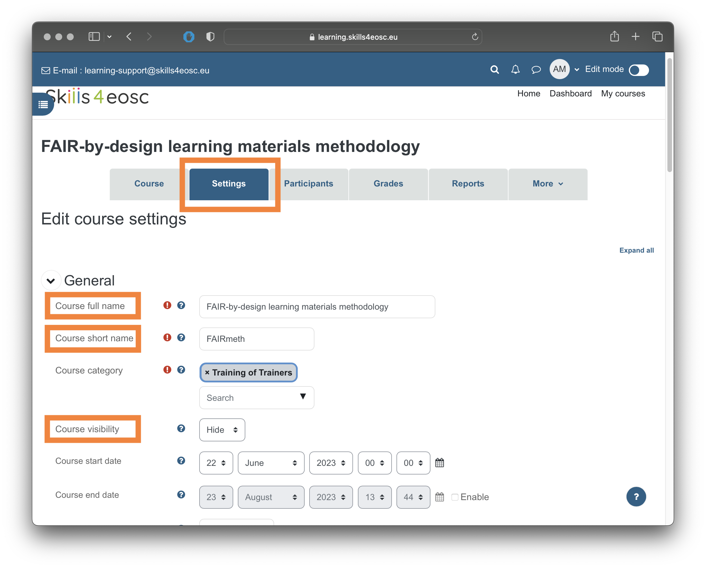
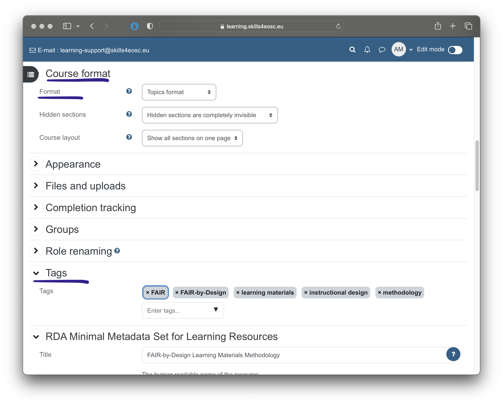
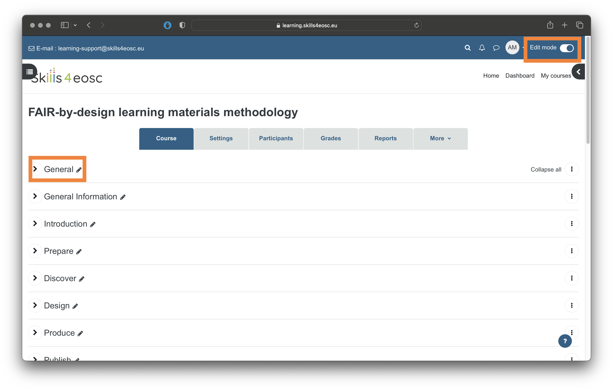
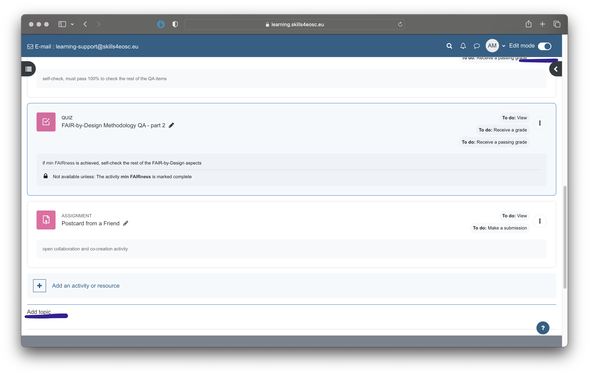
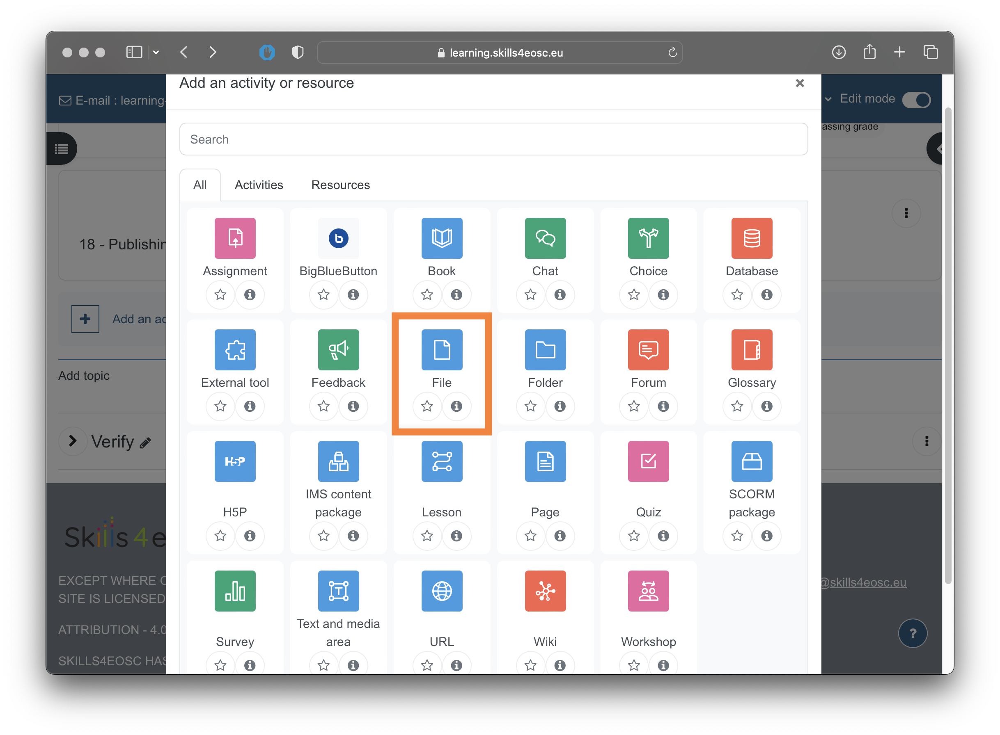
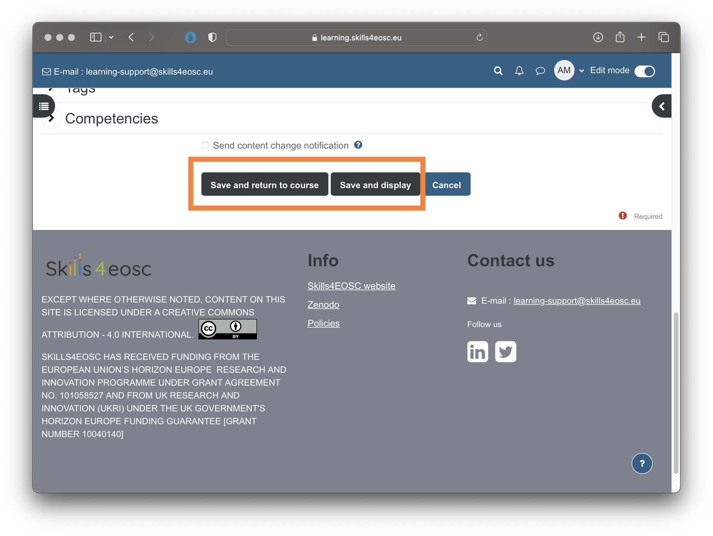

#  Publishing to learning platform

The learning materials targeted for consumption by the learners/trainees are usualy deposired in on the learning platforms, usually as parts of larger learning units such as courses.

## Learning Objectives

- Describe the procedure for publishing learning materials to the learning platform
- Using Moodle as prefered learning platform, explain the basic elements of the course
- Configure Moodle course parameters
- Add different elements to the course

## Target Audience

- Attendees of the FAIR-by-Design ToT live webinar

## Duration

35 mins

## Prerequisites

[16-Publishing Preparations](../16-Publishing%20Preparations/16-Publishing%20Preparations.md)

## Learning Tools

- Training BBB room
- Moodle lerning platform

## Description of the procedure for publishing to the learning platform

In this course we will be using the Skills4EOSC learning platform, available at [learning.skills4eosc.eu](https://learning.skills4eosc.eu). The learning platform is based on the popular and widely used open source learning managemet system (LMS) called [Moodle](https://moodle.org).
The initial step needed to publish a course at the learning platform is to request one from the platform's adminstrators. 
> NOTE: Before asking for the course creation, please create an account on the platform, using the "Log in" link at the upper right corner of the welcome page. 

To do so, write an email to [learning-support@skills4eosc.eu](mailto:learning-support@skills4eosc.eu) requesting the creation of the new course, as well as stating the names/emails of the people that will be assigned Trainer (Teacher) role of the course.
>NOTE: At least one person should be assigned the role Trainer (Teacher), allowing her/him to add more teachers to the course later. 

Once the course has been created, you can start customizing it and publishing the learning materials. 

### Configuring course parameters
The first action usually taken to a new course is to customise its settings. To customise settigns, one must have the Teacher (Trainer) role assigned. 

The main parameters that can be set are: Course full name, Course short name, Course visiblity, Course start and end date etc. 
>NOTE: Initially, Course visibility is set to Hide during the preparation of the course. This means that the Learnerns/Trainees can not see or access the course. 

Other parameters that could be set for a course include Course summary and image in the Course decsription section, that are displayed in the coruse list or dahboard.
To customise the way the course material is presented to the trainees, use the settings unde the Course format section. The Format parameter lets you choose between several format, including Weekliy format (sutaible for courses that are offered at the specific time, where material is grouped by weeks) or Topics format (where eachs section of the course is one topic). For courses that are offered as self learing courses, the Topic format is preferable. 

Defining tags for the courses helps the users discover the course when searching through the courses offering on the learning platform. 

### Creating course structure
When the course has been configured to be in the Topic format, the structure of the course consists of one General topic (created by default when creating the course) and number of Topics. Each topic is a contanier that will have different learning objects within. 

To make any changes to the courses, the editing mode has to be turned on, by clicking the switch in the upper right corner.

To add the new topic, use the "Add topic" link at the bottom left. Each topic will need to have a title as a minimum. 
### Adding PDF documents
Most common type of material that will be added to the courses on the learning platform will be pdf documents, whether they will be pdf versions of the presentations or other reading. 
As mentioned previously, to make any changes to the course, the editing mode needs to be turned on, by clicking the switch in the upper right corner.

The next step is to expand the topic that will contain the pdf file. Once expanded, the topic will contain a link titled "Add an activity or resource". By clicking this link, the selection of available activities and resources is displayed.

Select the "File" resource to proceed to the form for describing and uploading the pdf file. 
The required attribute of the pfd file is the Name.
To upload the file, you can drop the pfd file to the marked space, or use the upload dialog. 

To finalise the publishing of the pdf file, at the bottom of the page, use one of the Save buttons

The "Save and return to course" will save the changes and return to the home page of the course, displayng the topics. The "Save and display" button will save the changes and display the newly uploaded pdf file. 
### Adding links
The procedure for adding links to external resources is similar to the procedure for adding pdf documents. Course needs to be in the editing mode, the required topic should be expanded, and the link "Add an activity or resource" should be selected.

From the list of activities and resources, select the "URL" option. 
The required attributes are the Name and the External URL. 

Once the attributes are filed in, the saving options at the bottom of the page are the same as when adding files ("Save and return to course" and "Save and display").

### Working with quizzes
Moodle provides rich options for knowledge assessment in the form of Quizzes. Quizzes can contain different types of questions, from simple single or multiple choice, to more advanced types such as matching, drag-and-drop, calculated answers etc.  Most of the questions types can be graded automatically, with the exception of the "Essay" type, that needs manual grading. 
The questions used in the quizzes are organised in a question bank, offering a hierarchical structure for questions grouping. The grouping of questions in categories and sub-categories provides better support for automatization of the quizz creating process, offering random choice of questions from the same category, making the assessment more diverse. 
New questions to the question bank can be added either manually or by import. 

#### Adding questions to questions banks manually

#### Importing questions into questions banks
Importing GIFT files

#### Creating quizzes 
Creating quizzes, strategies

### Feedback gathering
Gather feedback from the participants

### Adding BBB rooms
Add BBB room to a course for online lectures/webinars

### Badges and certificates
To be done in collaboration with T2.4

### Making the course visible to learners
Showing the course on the platform

### Indexing the course in the EOSC catalogue
Making the course visible in the EOSC catalogue

## Exercise: Adding content to the course on the learning platform

The goal of this exercise is to describe how to add content to the previously created course on the learning platform.

## Key Takeaways and Information for Future Versions

We have published the first course on the learning platform.

## Suggested Reading

- [Semantic Versioning](https://semver.org/)
- [Zenodo REST API](https://developers.zenodo.org/)
- [Creating Encrypted Secrets for a Repository on GitHub](https://docs.github.com/en/actions/security-guides/encrypted-secrets#creating-encrypted-secrets-for-a-repository)
- [Zenodo Frequently Asked Questions](https://help.zenodo.org/faq/#general)