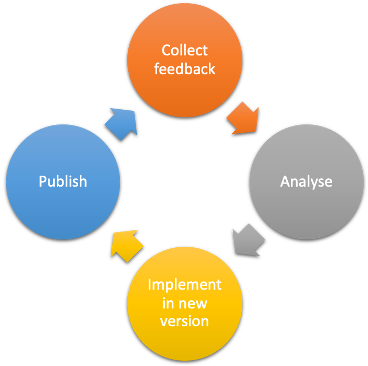

# Continuous Improvement

When you've passed through all of the FAIR-by-Design Methodology stages you have your high-quality FAIR learning material published and used by learners and instructors. Your focus should now be turned towards gathering feedback that will help you improve the learning material. Based on the analysed feedback you can decide what incremental changes to implement and create a new improved version of the learning materials. You are now also able to do this improvements in a co-creation process together with the wider community supporting different means of interaction with other potential contributors. 

## Learning Objectives

- devising a new version of the learning materials
- collaborating with external parties

## Target Audience

- attendees of the FAIR-by-Design ToT live webinar

## Duration

30 mins

## Prerequisites

Completed [19-Final QA check](../19-Final%20QA%20check/19-finalQA.md)

## Learning Tools

- Training BBB room
- Repo on GitHub 

## Incremental improvements 

Learning materials are never completely finished. There is always room for improvement and many times need and requirement to keep up to date with the development and changes in the field of subject of the learning materials.

Therefore a regular analysis of all QA aspects is necessary to identify potential elements for improvement. Based on the outcomes of the feedback analysis, the authors of the learning materials should make a plan for the development of a new version of the learning materials. 
 
### Feedback analysis 

As discussed in the previous learning unit, there are multiple sources that can serve for feedback gathering and QA:

- feedback form
- external QA recommendations
- self-reflection after training 
- GitHub issues
- gathered comments from external contributors
- direct mail contact 
- any other means of communication (e.g. feedback from workshops, discussions, team meetings, etc.)

The input from all of these sources should be gathered and analysed. The results of the analysis should be a list of potential improvements, each marked with an impact level (high, moderate, low). 

The next step is to decide which of the improvements will be addressed in the next version and how will this be achieved. Note that depending on the number of identified improvements, you might need to go through the improvement cycle multiple times. It is recommended that the changes are done in an incremental fashion and that changes done in one version are logically related. This help both developers and users to better understand the differences between the versions.

{: style="height:350px;"}

### New iteration

The work on a new iteration starts once the list of identified improvements that will be incorporated into the new version is finalised.

The next step is to organise the work regarding the required changes to the learning materials. Depending on the identified improvements, the changes may bring you back to the Produce stage implementing changes in learning units, or even to Design if restructuring of the learning material is needed.

When all planned changes are implemented following the requirements and recommendations of the (Design and) Produce stage(s), you can then move again through the Publish stage and create a new release with a new version number that will then be added as a new version on Zenodo. Note that the provided automated workflow will not create a new independent record on Zenodo, but will add a new version to the already existing one. For the specific steps of the publication process please refer back to the [respective lesson unit](../../Stage%205%20–%20Publish/17-Zenodo%20Publishing/17-Zenodo%20Publishing.md) in the Publish stage. 

The version number is one of the things that you will need to provide when activating a new release. The recommendation based on best practices is to keep the versioning in the Major.Minor.Patch version number sequence.

You will increment the minor number if the incremental improvement does not change the overall structure of the learning materials. You will increment the major number if the changes include change in the overall structure of the learning materials.The Patch number is used to indicate technical fixes. 

The image below depicts the best practices of semantic versioning.

{: style="height:250px;"}

[Semantic Versioning](https://commons.wikimedia.org/wiki/File:Semantic-versioning.svg) by [Surjit Bains](https://commons.wikimedia.org/w/index.php?title=User:SurjBains&action=edit&redlink=1) on [Wikimedia Commons](https://commons.wikimedia.org/) licensed under the [Creative Commons Attribution-Share Alike 4.0 International](https://creativecommons.org/licenses/by-sa/4.0/deed.en) license.

Don't forget to update the resource on the Learning Platform. This is a requirement if the learning material is provided as a self-paced course for an example, but might not be needed if it was a one-time training workshop event after which it is not expected that the learners will keep coming back to the learning content.

Note that if you are using the `/latest` links when adding the resources to the learning platform, you don't need to update any of the external links on the learning platform. However, be careful if the new iteration changes involved changes in the assessment or slide decks. 

### Co-creation with external parties

During the publishing process you have also created an open collaborative environment where external parties can directly participate in the process of development and improvement of the learning materials via co-creation. 

The co-creation support goes beyond providing feedback using the feedback form or suggestions from external QA reviewers. The established open collaboration environment using GitHub can be used by any external party to provide comments using several different means.

#### GitHub Issues

When the GitHub repository is made public (as it is required for publication to Zenodo), then the repository is open for anyone to browse and clone. This enables interested external parties to reuse the learning materials, but also analyse them in great detail. Any individual can also use the **Issues** feature to report problems/suggest changes.

All they have to do is go to the repository on GitHub, choose Issues and create a new Issue where they will describe the problem or suggestion. 

It is good etiquette to first check the list of open issues to see if the problem or suggestion has already been reported by someone else. Note that the external party should follow the rules of the provided Code of Conduct. If not, their messages can be disregarded and deleted. 

The owners of the repository will get a notification of the created issue and can decide how to respond (accept or decline with explanation).

#### Adding external contributors

Frequent reporters of meaningful issues or individuals that may have provided a significant feedback in some other form, may be willing to join the community of collaborators on the learning materials development. 

To support this type of co-creation in the form of close collaboration, the repository owners can add the external party as a new contributor to the repository with read and write access. This will mean that the external party will join the rest of the authors of the learning materials and become an equal member of the collaboration circle. For more information on collaboration options, revisit the [dedicated learning unit part of Stage 4 - Produce](../../Stage%204%20–%20Produce/14-Team%20Collaboration/14-Team%20Collaboration.md).

Note that after this you will grant the external party with rights to make changes to any documents in the repository, so they should be familiar with the established way the collaborative team works.

#### Contributing through forking

The most "advanced" way of co-creation (for GitHub beginners) is to use forking to contribute to a public project. This action can be done by any external party that does not have direct write access to the repository (is not added as a contributor).

By using a "fork and pull workflow" the external party can

1. Create a fork of the learning materials repository
2. Clone the fork so that the content is available locally
3. Create a branch where all changes will be stored
4. Make and push changes to the branch
5. Make a pull request which will propose the made changes to the main learning materials repository

The repository owner can review the pull request and decide to accept or reject it, or maybe ask for more information. Even if the owner decided not to accept the changes in the main repo, the fork will continue to exist separately and be visible to anyone browsing GitHub.

## Summary

Going through the FAIR-by-Design methodology workflow only once is not enough. Learning materials can always be improved and their content should be kept up-to-date. This is where the continuous improvement incremental changes come into play.

Analyse the identified improvement points, decide what to implement in a new version and go back through the methodology stages. 

**You are not alone on the continuous improvement journey!** Any external party can decide to help you by raising issues, joining your community of contributors or maybe suggesting changes with the fork and pull workflow.

## End of the journey

Congratulations! You have arrived at the end of this training. We hope that you have gained a great deal of knowledge and are now ready to put the FAIR-by-Design Methodology into practice.

As a final task please take a look at the Postcard from a Friend assignment on the Learning Platform.

And, of course, fill out the feedback form and help us improve!

**Do not forget! You are not alone!** The members of T2.3 are here to support you on your FAIR-by-Design journey. If you have any questions, problems, doubts, comments or anything else just use the contact email provided in the syllabus and we'll be there to give you a helping hand.

May your creativity flow and all your learning materials be FAIR!!!

## Suggested Reading

- [Real-time Iteration and Continuous Improvement: Plan, reflect, iterate, repeat](https://www.mooven.com/blog/continuousimprovement)
- [Semantic Versioning](https://support.invisionapp.com/docs/semantic-versioning)
- [Quickstart for GitHub Issues](https://docs.github.com/en/issues/tracking-your-work-with-issues/quickstart)
- [Contributing to projects - Quickstart guide by GitHub](https://docs.github.com/en/get-started/quickstart/contributing-to-projects)